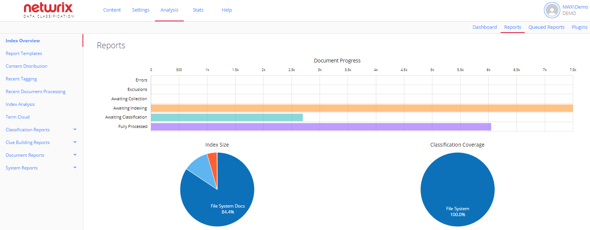

Filter: 

* All Files

Submit Search

# Top Reports and Charts

Several reports and charts do not belong to any group; they are on top of the list as they provide the most frequently requested information:

* **Dashboard**—Shows a high level overview of Netwrix Data Classification operations statistics.

* **Content Distribution** —Allows you to view the distribution of your content in several formats: grouping by source, grouping by taxonomy, or grouping by term. See [Content Distribution Map](ContentDistributionMap) for details.
* **Recent Tagging**—Displays statistics on the tagging results according to the specified filters. To view this data, make sure the "**Auto-Classification Change Log**" feature is enabled, as described above,
* **Recent Document Processing**—Displays statistics on the document processing results for the last 7 days. This includes collection, indexing and classification of data in the content sources.

* Index Analysis—Provides the ability to manually queue items for background index analysis, initially scoped to assist in identifying fuzzy matched duplicate documents.
* Term Cloud—Displays the top 50 key terms/phrases across the index, selecting a term expands the cloud into the related terms.