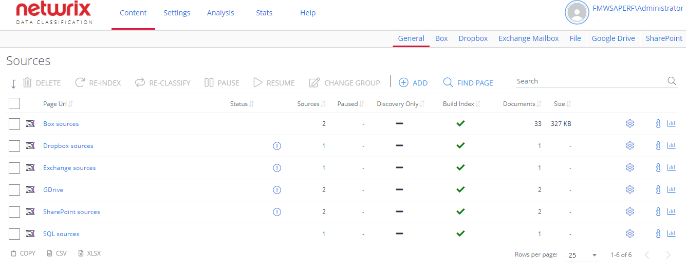

Filter: 

* All Files

Submit Search

# Manage Sources and Control Data Processing

The following commands are available on the **General** tab of the **Sources** section:

* Delete—Removes the source from processing. Its content will not appear in the search results in due course.

**NOTE:** This does not delete content from the external system

* Re-Collect—Queues the source for re-processing. Crawled items will be deleted, and the entire source re-crawled
* Re-Index—Queues a source or item to be re-indexed regardless of if the documents were changed or not. You can select Re-Index scope:

  * Selected Item(s) and All Descendants — select to Re-Index an Item and child of a child of so forth child element.
  * Selected Item(s) and Children — select to Re-Index an Item and its direct child elements.
  * Selected Item(s) Only — select to Re-Index only current item and ignore its child elements.
* Re-Classify—Queues a source or item to be re-classified against the latest configured classification rules

**NOTE:** See [Index Maintenance](../Utilities/IndexMaintenance) for more information on these operations.

* Pause—Temporarily pauses source content processing
* Resume—Resumes a source from a temporary pause
* Add To Group—Adds a source to a logical container (Source Group), either an existing or a newly created one.

Besides, in the source list on the **General** tab you can do the following for selected source:

* [View Results](ViewContent)
* **Edit** the source details by clicking on the "gear" icon
* **View source-specific statistics** by clicking on the "chart" icon
* **View detailed information** by clicking on the “i” icon
* **Navigate to the source** by clicking on the “link” icon

**NOTE:** When adding a source or managing source configuration, the most commonly used source settings are displayed by default. However, some source types have additional configuration options that can be displayed by clicking the Advanced Settings ("wrench" icon). You can allow these advanced settings to be always shown to authorized users. [See Users and Security Settings for more information.](../../Security/Users)

## Modify Source Settings

To edit configuration settings for the certain source, select the source and go to the corresponding tab, e.g. **Box** or **SharePoint**. Then you can, in particular, specify **Write configuration** (i.e. "tagging") settings and apply source-specific parameters. See [Use Tagging](Tagging) for more information.

See also:

* [Database](Database/ManageDatabase)
* [Exchange Mailbox](Database/ExchangeMailbox)
* [Manage File System](FileSystem/ManageFileSystem)
* [Google Drive](GoogleDrive/ManageGoogleDrive)
* [SharePoint](SharePoint/Introduction)