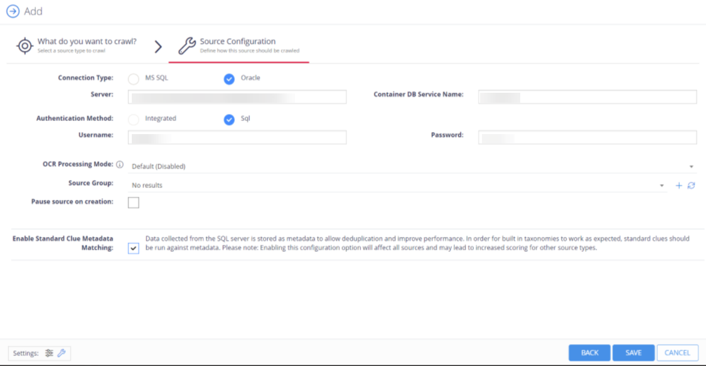

Filter: 

* All Files

Submit Search

# SQL Server

The SQL Server source configuration screen allows you to enable the crawling and classification of content stored in your MS SQL and Oracle servers. In comparison to the **SQL database**, you can crawl the whole server.

Once connected it is possible to create an intelligent content mapping, crawling certain fields as unstructured index text, and other fields as mapped metadata.

To crawl SQL server:

1. Go to **Content → Sources** and select **Add**.
2. Select **SQL Server**.
3. Specify [MS SQL Server](MSSQLServer) or [Oracle Server](OracleServer).

   
4. Select Save.

   You can then review summary, text, metadata, classifications, and properties of your crawling by selecting information icon against your server. You can also build the report for more details.

