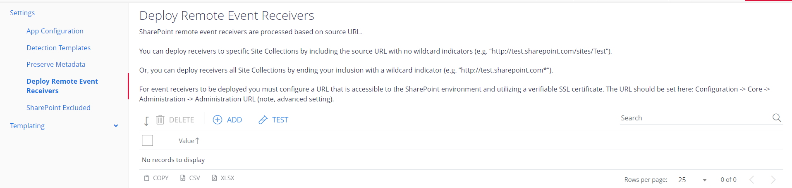
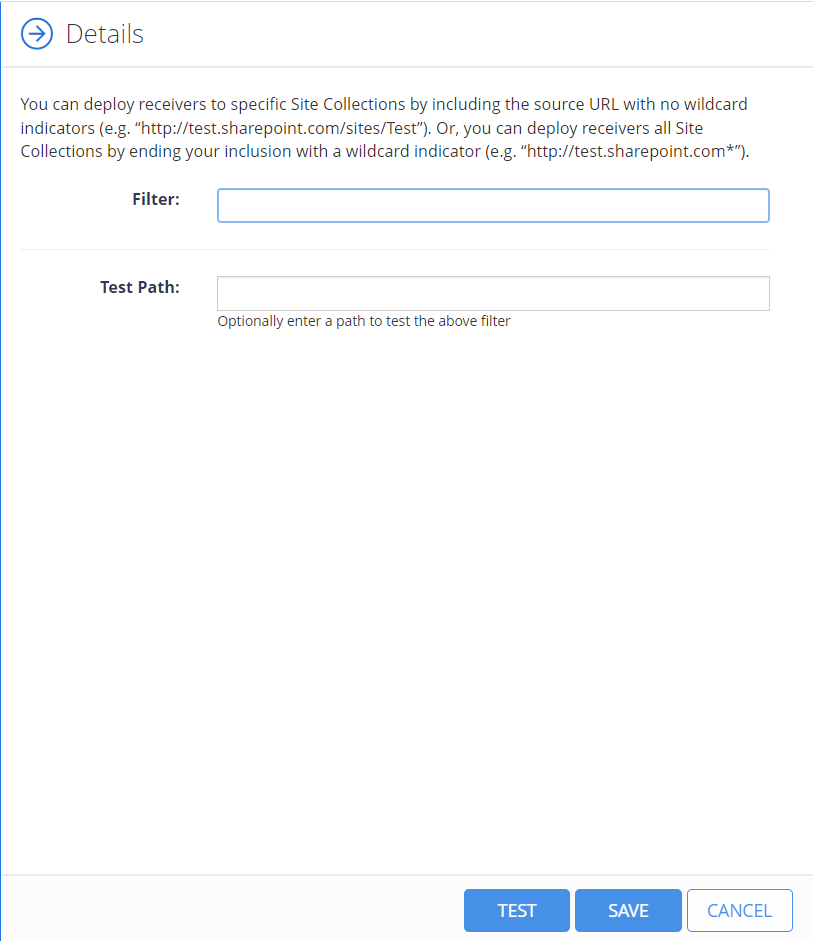

Filter: 

* All Files

Submit Search

# Deploying Remote Event Receivers for SharePoint

SharePoint remote event receivers are processed based on the source URL.
You can deploy receivers to specific Site Collections by including the source URL with no wildcard indicators (e.g. “http://test.sharepoint.com/sites/Test”).
You can also deploy receivers to all Site Collections by ending your inclusion with a wildcard indicator (e.g. “http://test.sharepoint.com\*”).

For event receivers you must configure a URL that is accessible to the SharePoint environment and utilizing a verifiable SSL certificate. The URL should be set here: Configuration → Core → Administration → Administration URL (note, advanced setting).

To deploy Remote Event Receivers:

1. Navigate to **Sources**→SharePoint→Settings→Deploy Remote Event Receivers.

   
2. Select **Add** to add the path. The **Details** panel displays.

   
3. Select **Save**.

**NOTE:** You can select **Test** to validate and compare the correctness of the path you enter.

d

**NOTE:** d