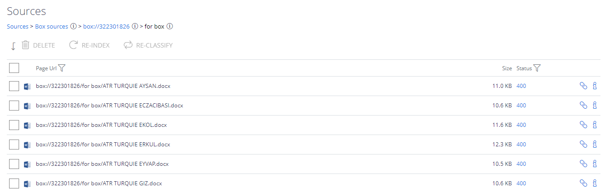

Filter: 

* All Files

Submit Search

# View Results

## Data Processing Statistics

Select the source from the list on the **Sources** - **General** tab, and click the **Reports** ("chart") icon to view data processing statistics for that source.

## Content Crawling and Classification Results

Click on a source row in the list of sources on the **General** tab to view the crawled data, including the number of processed documents/URLs (*Documents* column), the size of the crawled content (*Size*), status, etc.

To browse the whole structure of the crawled content, click on the items in the list. It is also possible to filter the list by any field.

* Each document has an associated status (shown as the ID). Click the numeric ID to read the status description:

* Click the "Info" icon for the document/item to view its **Properties**, including summary, classifications (if any), etc.:

* For content sources that support writing the classifications back to the source system, i.e. "*tagging*" (e.g. such as writing classifications to SharePoint managed metadata fields):
  * a tick will also be displayed if tagging was successful
  * a cross displayed if tagging failed

See the related content source description for details.