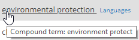

Filter: 

* All Files

Submit Search

# Adding a Clue

To add a new clue, go to the topmost row in the list and specify clue properties, as explained below:

* Type
* Clue (rule body)
* Score
* Is Mandatory

When ready, click **Insert** on the right.

## Clue Body

When specifying the clue body, consider exact matching and stemming explained below.

### Exact Matching

There may be any number of words up to a maximum of 200 characters per clue. However, most clues will consist of one, two or three words.

Use double quotes around phrases to invoke exact phrase matching.

### Stemming

Word stemming simplifies classification rules by automatically matching inflected word forms using a single keyword clue. This can be useful to identify how a clue will be implemented by the classification engine. Stemming is supported for the following languages:

* Dutch
* English
* French
* German
* Hungarian
* Spanish
* Portuguese

Hovering over a standard clue will show the stemmed version of the word / compound term.

Example: A class called *Global Warming* may have the following clues:

* Global Warming
* Greenhouse Gases
* CO2 Emissions
* Pollution

To disable stemming, use double quotes around single words.

## Score

Scores are expressed as percentages of the threshold. For example, if the threshold is 50 then:

* 50 = guarantees that this term alone will be sufficient to classify the document
* 25 = this term will get half way to the target
* 10 = this term is of low importance but its presence should boost a document score
* 0 = zero weight – use to disable a clue
* -10 = this term is a small negative indicator
* -50 = this term is a strong negative indicator
* -1000 = the presence of this term should force the document to not be classified

Higher scores indicate a stronger association with the topic.

* Example 1: *Global Warming* with a score of 50 will cause a document with this concept to be matched.
* Example 2: *Pollution* with a score of 20 (on its own) will not be sufficient to cause the document as being about global warming.

Consider that clues can also be assigned a negative value, which will prevent incorrect associations.

* Example 3: *Noise pollution* should not be associated with *Global Warming*. So *Noise pollution* would be added with a negative value.

## Mandatory Clues

You can use the Mandatory checkbox to indicate that a clue is required, i.e. a document cannot be classified against a category unless it matches all of the mandatory clues.

The mandatory clue selector is denoted by the \* icon:

## Using the Local Option

In some cases, a further option will be available per clue: “**Is Local?**”. This option allows the user to restrict a clue purely to the current Term Set.

**NOTE:** This option is only available for reused terms (SharePoint Term Sets).

* Once this option is selected, it will not be possible to amend the clue from any other Term Set that contains the re-used Term.
* If you want to share the Term across all Term Sets again, clear the option from the Term Set in which it was originally enabled.

## Using Synonyms (SQL taxonomies only)

**NOTE:** The **Synonyms** link is only available for the clues in SQL taxonomies.

The Synonyms link can be used to enter synonym definitions.

In general, the use of this facility is not recommended. The preferred approach is to enter each synonym as separate clues. Entering each synonym as separate clues will generally result in more accurate scoring and therefore to better classification results.