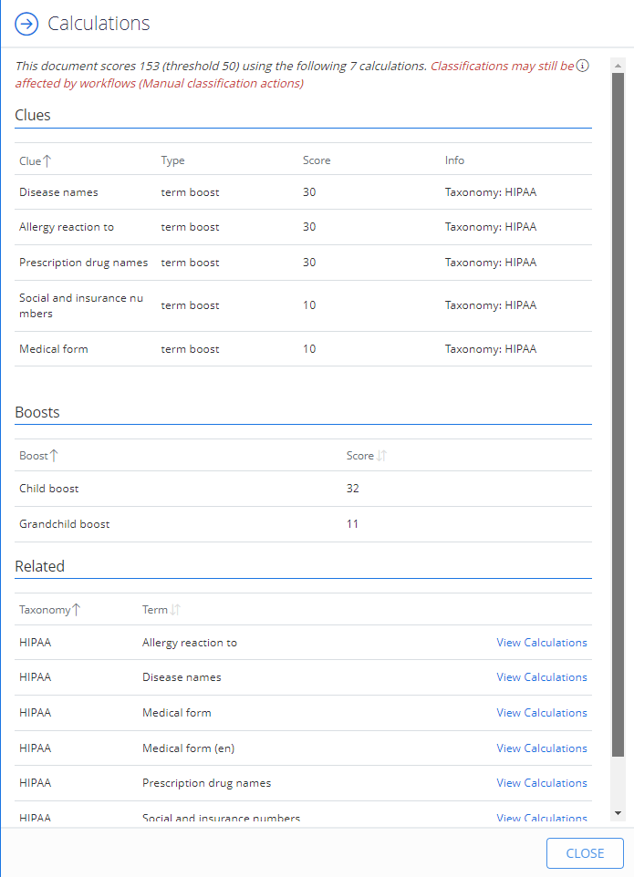

Filter: 

* All Files

Submit Search

# Calculations

Follow the steps to review the calculations for taxonomy:

1. Select Content > Taxonomies.
2. Choose the required taxonomy.
3. Select Browse.

   
4. On the classified file, click the Calculator icon. You shall see how the classification scores are calculated.

   

This will show the classification calculation using the latest clues definition.

There are three sections:

* Clues – Shows how each clue contributed to the total score.
* Boosts – Shows what boosts were added to the clue scores when related terms were processed (e.g. Parent and Child terms).

* Related—Shows a flat list of terms that were linked by "Boosts" (including chained links). Selecting a term will alter the display to show the corresponding clues / boosts / filters for the linked term.