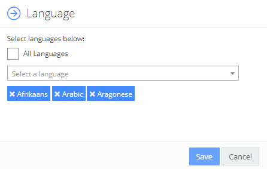

Filter: 

* All Files

Submit Search

# Languages for Clue

Each clue can be restricted to documents written in a subset of the available languages. This is useful if a word in one language also appears in another language but has a different meaning.

In this case you can click the Languages link beside each clue and select any subset of the available languages:

