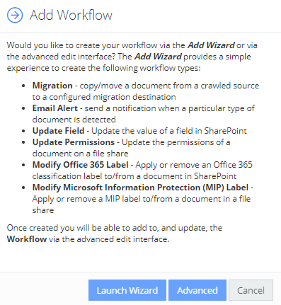

Filter: 

* All Files

Submit Search

# Create a Workflow using Add Workflow Wizard

To create an automated workflow for certain type of documents, you can use the Add Workflow wizard or **Advanced** dialogs.

To launch the Add Workflow wizard:

1. In the administrative web console, select Workflows from the top menu.
2. Click the Workflows tab.
3. Click the Add button in the upper right corner.
4. In the dialog displayed, click the Launch Wizard button.

See next:

* [Step 1. Select Content Type](Step1SelectContentType)
* [Step 2. Select Action](Step2SelectAutomatedAction)
* [Step 3. Specify Conditions for Processing](Step3SpecifyConditions)
* [Step 4. Enter Name and Review Settings](Step4SetNameAndEnable)

**NOTE:** Once created you will be able to modify the workflow using the **Advanced** dialog.

Alternatively, take steps 1-3 from the procedure above, then in the **Add Workflow** dialog click **Advanced**. See [Configure a Workflow using Advanced dialog](AdvancedWindow/CreateWorkflow)