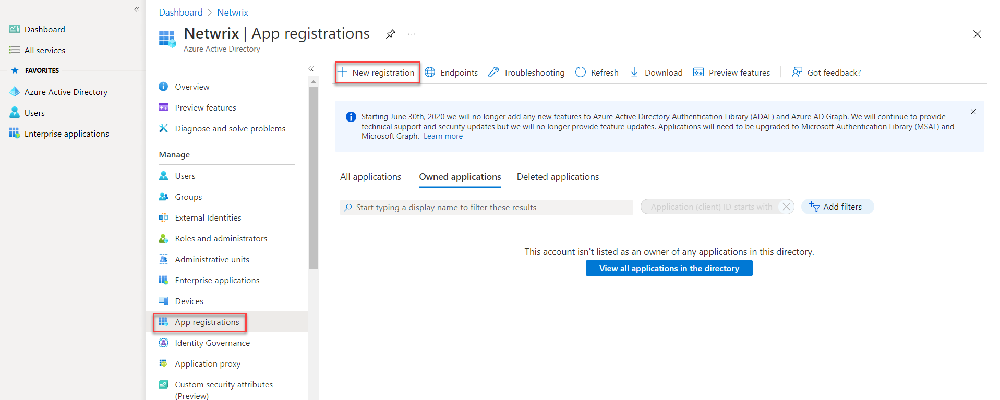

Filter: 

* All Files

Submit Search

# Create Azure AD app for Modern Authentication

To connect to Exchange Online organization that uses Modern authentication, you need to create an Azure AD application, as described in this section.

## Step 1: Prepare application certificate

Prepare application certificate as follows:

1. Create (or load) an IIS certificate on NDC Server (recommended).

**NOTE:** This certificate should be installed for the local machine so that it can be accessed by Netwrix Data Classification and other services.

2. Export the certificate (.CER file):
   1. Open the certificate in IIS management console.
   2. Go to the **Details** tab.
   3. Select **Copy to File**.

   **NOTE:**  Do not export private key.

   4. Set file type to *DER-encoded CER*.

## Step 2: Create and Register a new app in Azure AD

To register a new Azure AD application, do the following:

1. Sign into the **Microsoft 365 Admin Center** (with your *Global Administrator*, *Application Administrator* or *Cloud Application Administrator* account) and go to the **Azure Active Directory admin center**.
2. Search for and select the **Azure Active Directory admin center**.
3. Under the Azure Directory select the **App registrations** section.
4. Select **New registration**:

5. In the **Name** field, enter the application name.
6. In the **Supported account types** select who can use this application – use the **Accounts in this organizational directory only** option.
7. Click the **Register** button.

**NOTE:** Application redirect URl is optional, you can leave it blank on this step.

8. . Copy your application ID from the **Overview** section to a safe location.

## Step 3: Grant Required Permissions

Next, you need to grant your new application the required API permissions.

Azure AD applications can be assigned *Delegated* or *Application* permissions:

* *Delegated* permissions require a signed-in user present who consents to the permissions every time an API call is sent.
* *Application* permissions are consented by an administrator once granted.

For the newly created app, you should use *Application* permissions.

**NOTE:** By default, a new application is granted one delegated permission for **Microsoft Graph API** – **User.Read**. It is not required and can be removed.

Do the following:

When found, click on the entry and proceed with adding the necessary permissions. The steps from here on remain the same, you would need the Application permissions entry, and the relevant set of permissions therein (such as full\_access\_as\_app for EWS OAuth, Exchange.ManageAsApp for CBA). Select the relevant entries, hit the Add permissions

1. At the top of the **Request API permissions** pane, click the **APIs my organization uses** tab and search for *Office 365 Exchange Online*.
2. Go to APIs my organization uses and search for "office" in the search bar.
3. Select Office 365 Exchange Online.
4. Click on the *Office 365 Exchange Online* entry in the list of apps found.
5. Proceed with adding the permissions for this app: select **Application permissions** and then select **full\_access\_as\_app**.
6. Click **Add a permission**.

Finally, you need to grant admin consent to the tenant (that is, for Exchange organization whose audit data will be collected by the newly registered app).

Do the following:

1. Go to the new app settings > **API permissions** and click **Grant admin consent for ****.
2. When prompted to confirm granting, click **Yes.**

## Step 4: Configure Certificates & secrets

Having configured the app, you can upload its application certificate.

1. In the app settings, click **Certificates & secrets** and select **Upload certificate**.
2. Upload the .CER file you prepared at [Step 1: Prepare application certificate](#Step1).
3. Copy the certificate thumbprint to a safe location.

## Step 5: Obtain Tenant ID

1. Open **Azure Active Directory admin center**.
2. Select **Azure Active Directory > Overview** section for the required Exchange Online organization.
3. Locate the **Tenant ID** and copy it to a safe location.