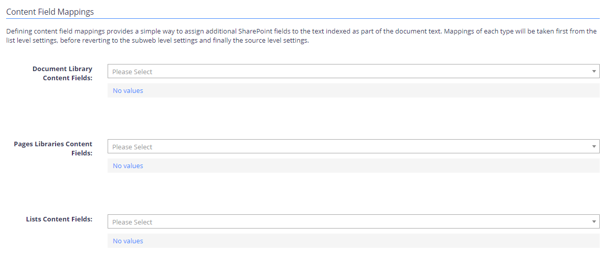

Filter: 

* All Files

Submit Search

# Configuring defaults

The Source Defaults tab allows you to configure defaults that will be used in the absence of list / subsite configurations. Available options are listed in the table below.

**NOTE:** To apply the options you set in each section, click the **Save** button in that section.

| Option | Description | Notes |
| --- | --- | --- |
| **General** | | |
| Re-Index Period | Specify how often the content should be re-re-indexed. | Default is every 7 days |
| Text Patterns | Specify the text patterns to be used. | Default is ALL |
| Write classifications? | Select the checkbox if you want to use tagging. | See "Configure Tagging" section above. |
| **Date Field Mappings** | | |
| Document Date | Assign the internal modified date associated with the document.  The selected date will be split into 5 internal fields: *DocYear*, *DocMonth*, *DocDay*, *DocHour*, *DocMins*. |  |
| Backup Document Date | You can use the dropdown lists to search for and assign fields to the appropriate mappings. |  |
| **Special Field Mappings** | | |
| The special field mappings allow you to map any of the available SharePoint fields to some of the internal fields for the purposes of search. | | |
| **Content Field Mappings** | | |
| The values configured for each of the default content mappings will be assigned based on the base template of the list (Document Library, Generic List etc). | | |

