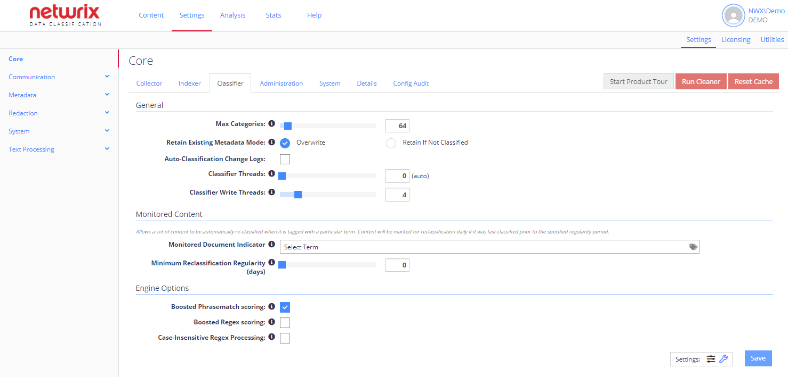

Filter: 

* All Files

Submit Search

# Configuration Options

The Config administration area allows you to specify global system configuration settings. The default screen shows the most commonly amended settings.

The most frequently used settings are displayed by default. Some configuration options are hidden and can be shown by selecting the Advanced Settings ("wrench" icon). Note that they will be only available [See Users and Security Settings for more information.](../Security/Users)

See next:

* Core Configuration
* [Communication Settings](CommunicationSettings)
* [Metadata Configuration](ConfigMetadata)
* [Redaction](Redaction)
* [System Configuration Settings](SystemConfiguration)
* [Text Processing](TextHandling)
* [MIP Labels Configuration](../Admin/Workflows/MIPLabels/ConfigureNDC)
* [Language Stemming](LanguageStemming)