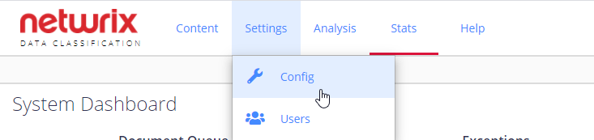

Filter: 

* All Files

Submit Search

# System Configuration

**System Configuration** section in Netwrix Data Classification management console includes **Config** and **Users** areas:

* To specify Netwrix Data Classification settings and manage licenses, click Config.
* To set up user roles and security privileges, click **Users**.

See next:

* [Configuration Options](Configuration)
* [Users and Security Settings](../Security/Users)