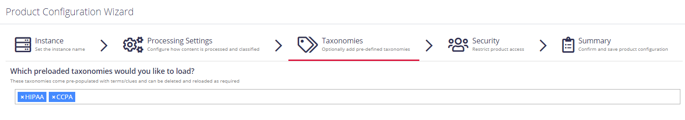

Filter: 

* All Files

Submit Search

# Add Taxonomy

On this step, you are prompted to load predefined taxonomies.

Click the search bar and select one or several taxonomies you want to add. See [Built-in Taxonomies Overview](../../Admin/Taxonomies/BuiltinTaxonomies) for the full list of built-in taxonomies supported by Netwrix Data Classification.