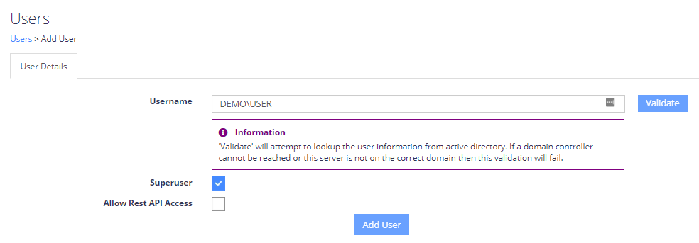
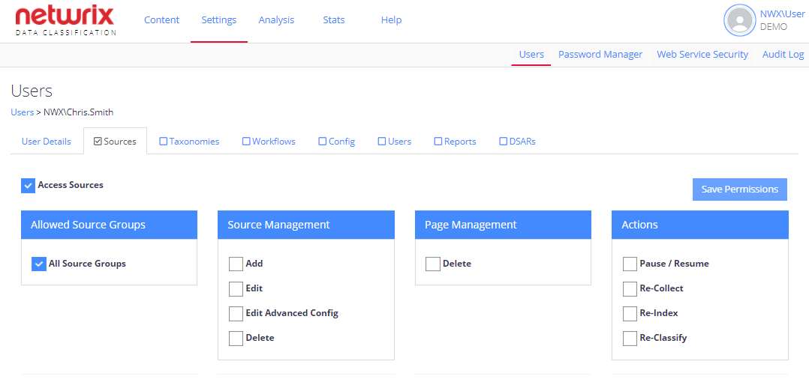
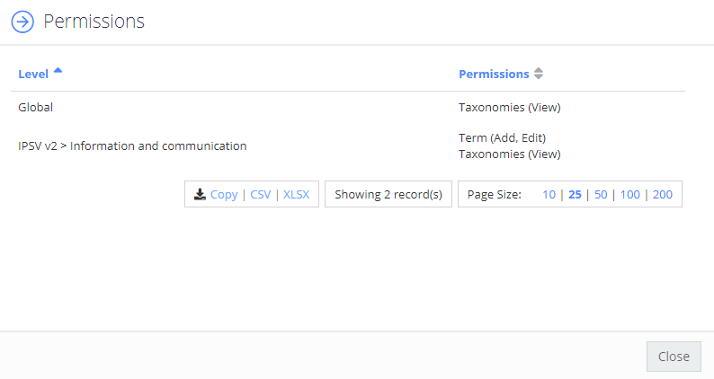

Filter: 

* All Files

Submit Search

# User Management

This topic contains information on how to configure user authentication mechanisms, their permissions and manage existing users.

## Authentication Mechanisms

On first install the QS will be configured for Windows authentication. To setup the QS to use an ADFS server please follow the "Installation and Configuration" guide using the section "ADFS". To use forms based authentication please disable all other authentication methods in IIS other than: Anonymous and Forms:

Follow the steps to use authentication forms.

**Step 1 –** Check that the “authentication mode” setting in conceptQS/web.config file is set as follows:

*  (This is the default setting.)

**Step 2 –** Check that the Authentication settings are correct in IIS for Windows Authentication:

The conceptQS web application should have these authentication methods enabled:

* Anonymous Authentication
* Windows Authentication

All other authentication methods should be disabled.

**Step 3 –** If you wish to allow anonymous access to the conceptQS, edit the conceptQS web.config file and delete (or comment out) three lines:

If these lines are present then users will be required to login using their Windows credentials.

## Configure Microsoft Entra ID Authentication

To configure Microsoft Entra ID you need to create aclient application and add two new appSettings to the "" section of the web.config file in the QS directory:

* ``
* ``

The Netwrix Data Classification REST APIs also support Bearer based authentication, to enable this mode please add one further appSetting entry into the web.config file:

* ``

In certain sections of the QS settings are split between Basic and Advanced. Users wishing to always see Advanced options can enable this by:

* Selecting their username from the footer of the application
* Clicking **User Preferences**
* Ticking **Always Show Advanced Settings**
* Clicking **Save**

See the following Knowledge Base topic to learn how to set up single sign-on for Netwrix Data Classification via Microsoft Entra ID authentication: [https://helpcenter.netwrix.com/bundle/z-kb-articles-salesforce/page/kA00g000000H9e8CAC.html](https://helpcenter.netwrix.com/bundle/z-kb-articles-salesforce/page/kA00g000000H9e8CAC.html "https://helpcenter.netwrix.com/bundle/z-kb-articles-salesforce/page/kA00g000000H9e8CAC.html")

## Add or Remove Users

More users can be added at any time from the default Users screen, as well as allowing for users to be removed.

Additional Windows users can be validated using Integrated Windows Authentication. Additional non-Windows users can only be added if the Non-Windows Authentication mode is enabled.

If the only user defined is a Super User and that user is deleted then all security is removed and usage of the QS administrative functions reverts to unrestricted.

User accounts granted access to the REST APIs will still be restricted by their specific user permissions. A Superuser with REST API access will be able to run any API method, any normal user will be restricted by the same rules that govern the UI. Further API samples and documentation can be found at: /conceptQS/\_api

## Permission Management

In order to allocate granular permissions to a user (non-Super Users), simply select their username from the main grid.

Each tab contains a top level checkbox (“Allow Access”) which defines whether or not a user has access to each of the top level administrative areas.

When an area is enabled there are typically more granular permissions that can be enabled, such as:

* Within the Taxonomies area it is also possible to assign permissions at a specific Term Set or Term branch level. A full user permission summary (for all Term/Set level permissions) can be viewed by selecting the View Taxonomy Permissions button (shown below).
* Within the Sources area it is possible to restrict a user’s access to specific source groups, as shown below.

### Taxonomy Permissions Summary

The Permissions window lets you restruct permissions for a user.

You can restrict permissions for a user to the following areas:

* Sources. See [Content Sources](../Admin/Sources/Introduction) for additional information.
* Taxonomies. See [Taxonomies](../Admin/Taxonomies/Introduction) for additional information.
* Workflows. See [Understanding Workflows](../Admin/Workflows/Overview) for additional information.
* Configuration options. See [Configuration Options](../Configuration/Configuration) for additional information.
* Users. See [Users and Security Settings](Users) for additional information.
* Reports. See [Reporting Capabilities](../Admin/Reporting/Capabilities) for additional information.
* DSARs. See [Data Subject Access Requests](../Admin/DSAR/Overview)  for additional information.

## Super Users

Super Users always have access to all Query Server administrative functions.

Non-Super Users must have their access rights specifically configured and all rights are disabled by default. See [User Management](#Permission_Management "Permission Management") section for details about configuring the access rights for non-Super Users.

Regardless of the authentication mode selected the usage of the QS administrative functions will continue to be unrestricted until at least one user is added. The first user must be a Super User. If Windows or ADFS Authentication are being used then the first user will default to the currently logged in user, although this can be changed if required.

If Non-Windows Authentication is enabled then additional information must be entered to define the non-Windows user.