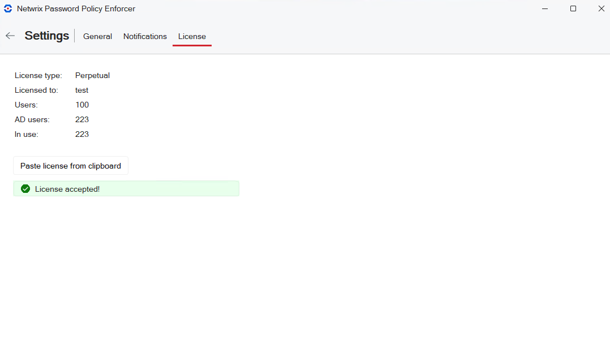

# Configuration Console

The PPE Configuration Console manages Password Policy Enforcer across your domain. It can be installed on multiple servers/workstations as convenient.

Open the Configuration Console:

Click **Start** > **Netwrix Password Policy Enforcer** > **PPE Configuration**  
or   
Double click the **PPE Configuration** desktop shortcut.

## Dashboard Controls

The Configuration Console dashboard has all the tools you need to set up and manage Password Policy Enforcer.

* [Enable/Disable Password Policy Enforcer](#Enable/D "Enable/Disable Password Policy Enforcer")
* [Connected To](#Connecte "Connected To")
* [Help](#Help "Help")
* [Settings](#Settings "Settings") - [General](#General "General"), [Notifications](#Notifica "Notifications"), [License](#License "License")

In addition, there are tiles to access Password Policy Enforcer major features:

* [Manage Policies](Manage Policies#Policy "Policies")
* [Compromised Password Check](CompromisedPasswordCheck#Compromi "Compromised Passwords Check")
* [System Audit and Support](SystemAudit#System "System Audit and Support") - Version Tracker, Support Tools, Property Editor

See the specific topics for details.

### Enable/Disable Password Policy Enforcer

The toggle enables/disables Password Policy Enforcer on all domain controllers. It is enabled by default.

Click the toggle to disable PPE:

If PPE  is disabled, click the toggle to enable:

### Connected To

Sets the configuration for **Domain** (default) or **Local**. Password Policy Enforcer's configuration settings are stored in Active Directory or the registry. An Active Directory configuration is called a domain configuration, and it defines the password policies for domain user accounts. A registry configuration is called a local configuration, and it defines the password policies for local user accounts.

Domain configurations are stored in the **CN=Password Policy Enforcer** *version***,CN=System object**.

Local configurations are stored in the **HKLM\SOFTWARE\**ANIXIS**\Password Policy Enforcer** *version***\ registry key**.

**NOTE:** Users with write permission to these objects can configure Password Policy Enforcer.

Domain

* Defines policies for domain user accounts.
* Select a Domain Controller from the list of domain controllers where PPE is installed.
* Configuration is replicated to all the domain controllers in the domain.

Local

* Defines policies for local user accounts.
* Only affects the computer where it is set.
* You can copy a local configuration to another computer by exporting the configuration from the registry, and then importing it into the registry of the other computer. You can also use Group Policy to distribute a local configuration to many computers. See the [Domain and Local Policies](Domain and Local Policies "Domain and Local Policies") topic for additional information.

### Help

Links to documentation and support tools.

* **Netwrix Help Center** launches the Password Policy Enforcer help.
* **About** displays the Configuration Console version.
* **Export Configuration Report** opens an export dialog. You can export the configuration as an html or txt file. Browse to the folder where you want the report.
* **Open Property Editor** launches the Property Editor.

  **NOTE:** Properties should only be changed when advised by Netwrix Support.

### Settings

There are three tabs:

* [General](#General "General Settings tab")
* [Notifications](#Notifica "Notifications Settings Tab")
* [License](#License "License Settings Tab")

#### General

Open the **Settings** > **General** tab to set up policy and log settings. The general settings apply to either the domain or to a local computer, depending on your [Connected To](#Connecte) configuration setting.

If you make changes, click **Save** to keep your changes or **Discard** to cancel.

Here are the default settings.

* **Default policy** sets the policy to be enforced on the domain or local computer unless users have a different policy assigned to them.
* **Enforce policy when password is reset** requires users, administrators and helpdesk operators to comply with the password policy when resetting a password or creating a new user account. Default is checked.

  * Minimum Age rule is never enforced during a reset.
  * History rule is enforced if this option is selected and the **Enforce this rule when a password is reset** option is selected on the [History Rule](History Rule "Open History Rule topic") Properties.
* **Accept encrypted client request only** specifies requests from Password Policy Client, Netwrix Password Reset and Password Policy/Web must be encrypted. Client requests do not contain passwords or password hashes. See the [Password Policy Client](Password Policy Client "Password Policy Client") topic for additional information. Default is checked.
* **Log event when password not checked by service** adds an entry to the Windows Application Event Log whenever it accepts a password without checking it. Default is checked. This can occur if:

  * Password Policy Enforcer is disabled.
  * The policy assigned to a user is disabled.
  * No policy is assigned to a user or an error occurs when determining the assigned policy, and a Default Policy is not specified.
  * A password is reset, and the **Enforce policy when password is reset** is not selected.
* **Log event when password rejected by service** adds an entry to the Windows Application Event Log whenever a password is rejected. Default is not checked. The logged event includes:

  * Username
  * Source (client or server)
  * Rules the password does not meet.

    **NOTE:** Passwords or password hashes are not sent over the network.

  Most rules are enforced by both the Password Policy Client and Password Policy Server. If the Password Policy Enforcer Client is installed, a non-compliant password can be rejected before Windows sends it to the domain controller. The following limitations apply when a password is rejected by the Password Policy Client:

  * An event is only logged if the Password Policy Enforcer Client version is 9.0 or later. If a password is rejected by the Password Policy Server, then the event is logged.
  * Client logged events only show the local rules the password violated. For example, the Compromised rule is only enforced by the Password Policy Server. See the [Rules](Rules "Rules") topic for additional information.
  * Client rejections can be lost or duplicated if there are communication issues between the Password Policy Client and Password Policy Server.
* **Log event when password accepted by service** adds an entry to the Windows Application Event Log whenever a password is accepted. The logged event includes the username. Default is not checked.

#### Notifications

Open the **Settings** > **Notifications** tab to set up notifications. Notifications are only available when **domain** is selected with the [Connected To](#Connecte) configuration setting.

If you make changes, click **Save** to keep your changes or **Discard** to cancel.

Here are the default settings.

* **Send email reminders**: check this option to send reminders. Default is not checked.

  * **SMTP Server**: enter IP address.
  * **Port**: enter port number.
  * **Username**: enter your username.
  * **Password**: enter your password.
  * **Use TLS**: check this option to enable TLS email encryption.
* **Save email to a pickup folder**: check this option to have the Mailer save emails to a folder for later delivery by a mail server. The mail server must monitor this folder for new email.

  * **Path**: Click **Browse** and select the path to the pickup folder.

**NOTE:** Saving email to a pickup folder is the fastest and most reliable delivery method. Use this option if your mail server supports pickup folders.

The Password Policy Enforcer Mailer sends emails at 2:00 AM every day (local time on your server). Check the Windows Application Event Log to monitor its progress. You can also run the Password Policy Enforcer Mailer from the command line to send email immediately, or to troubleshoot problems.

**NOTE:** You can change the time the mailer runs. Set the **PPE Mailer** service startup to **Disabled** or **Manual**, then stop the service. Create a task to run "**PPEMail /send**" at the desired time.

#### License

Open the **Settings** > **License** tab to view your current license. The license settings apply to either the domain or to a local computer, depending on your [Connected To](#Connecte) configuration setting.

To add or update your license, copy it from the email or file, then click **Paste license from clipboard**.

* **License type** and **Licensed to** are set based on your sales agreement.
* **Users** is the total number of available licenses.
* **AD Users** is the total number of Active Directory user accounts.
* **In use pertains** to active AD user accounts, disregarding disabled accounts.