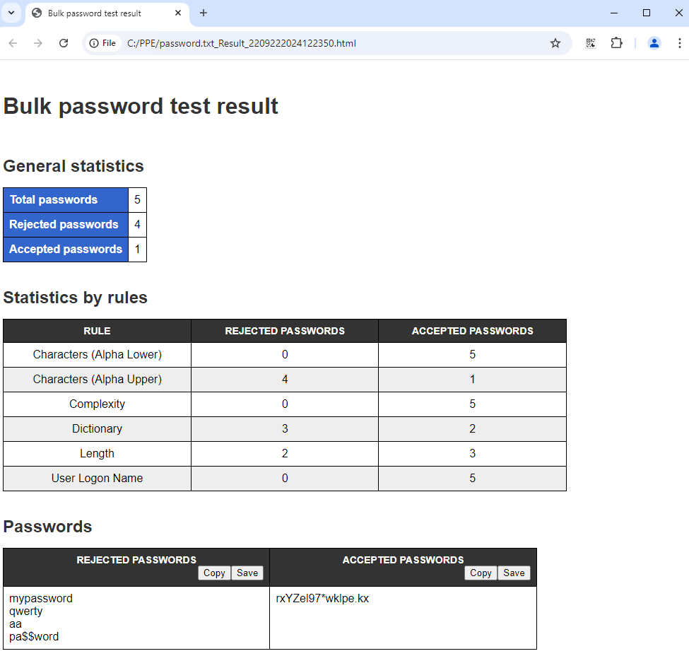

# Get-PPEBulkPasswordTest

The **Get-PPEBulkPasswordTest** cmdlet runs the Password Policy Enforcer bulk password test of the specified policy.

SYNTAX

**Get-PPEBulkPasswordTest** **-PasswordFile**  **-Policy**  **-ResultFolder**  []

PARAMETERS

**-PasswordFile** 

Path and name of the text file containing the passwords to test. Passwords in your test file are 1 per line.

**-Policy** 

The name of the policy to enforce for the test.

**-ResultFolder** 

The folder for the created html report.

This cmdlet supports the common parameters: **Verbose**, **Debug**, **ErrorAction**, **ErrorVariable**, **WarningAction**, **WarningVariable**, **OutBuffer**, **PipelineVariable**, and **OutVariable**. For more information, see about\_CommonParameters [https:/go.microsoft.com/fwlink/?LinkID=113216](../../../Password Policy Enforcer/Administration/https:/go.microsoft.com/fwlink?LinkID=113216).

EXAMPLE

PS C:\> Get-PPEBulkPasswordTest -PasswordFile C:\PPE\password.txt -Policy "Eval Policy" -resultFolder C:\PPE

Bulk test is running...

The report is created: "C:\PPE\password.txt\_Result\_2209222024122350.html".

