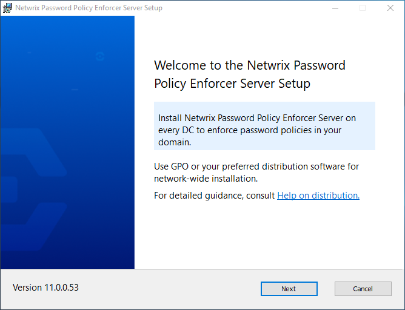
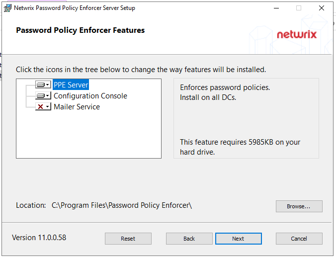

# Install Password Policy Enforcer on a Server

Password Policy Enforcer server should be installed on every domain controller to enforce the password policy for domain user accounts, or on individual servers and workstations to enforce the password policy for local user accounts.

If your domain contains some read-only domain controllers, then installation of Password Policy Enforcer on these servers is only necessary if you are using the following features:

* [Rules](../Administration/Rules#_bookmark48 "Maximum Age Rule")
* [Password Policy Client](../Administration/Password Policy Client "Password Policy Client")
* [Netwrix Password Reset](https://helpcenter.netwrix.com/category/passwordreset "Netwrix Password Reset")
* [[Password Policy Enforcer Web](../Web/Web Overview "Web")](../Web/Web Overview.htm "PPE/Web")

The Server installation package includes multiple features selected during installation:

* PPE Server – enforces password policies. It can be installed on Domain Controllers for domain password policy, or on servers and workstations for local account password policy.
* Configuration Console – manages policy configuration. Install where ever needed.
* Mailer Service – sends email reminders. Install on any server.

**Step 1 –** Download the installation package from Netwrix.

**Step 2 –** Extract the installers from the compressed file. If you are going to use Group Policy Manager to install Netwrix Password Policy Enforcer, copy the **msi** files to a distribution folder. See the [Install with Group Policy Management](InstallationGPM "Install with GPM") topic for additional details. You can also install/uninstall the products using command line [Silent Installation](../Administration/Command Line Interface#Silent "Silent Installation").

**NOTE:** Continue with these steps to install one or more features on your current server or domain controller. You must repeat these steps for each server where the features are installed.

**Step 3 –** Click on the **Netwrix\_PPE\_Server\_*version*\_x64.msi** installation package. The installer is launched.

**Step 4 –** Click **Next**.

**Step 5 –** Review the End-User License Agreement. Click **I accept the terms in the License Agreement**.

**Step 6 –** Click **Next**.

**Step 7 –** Select the features to install. The required storage is shown for each selection.

* PPE Server – enforces password policies. It can be installed on Domain Controllers for domain password policy, or on servers and workstations for local account password policy. It is not selected by default.
* Configuration Console – manages policy configuration. Install where ever needed. Selected by default.
* Mailer Service – sends email reminders. Should be installed on a Domain Controller. It is not selected by default.

**Step 8 –** The default location is shown. Click **Browse** and select a new location if needed.

**Step 9 –** Click **Next**.

**Step 10 –** Review your selections. Click **Back** to make any changes. When ready, click **Install**.

**Step 11 –** Click **Finish** when installation is complete. You are prompted to restart your system for the changes to take effect.