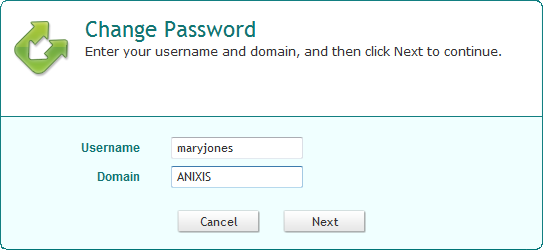

# Launch Password Policy Enforcer Web

The default URL for Password Policy Enforcer Web is: `http://[server]/ppeweb/`

Where [server] is the name or IP address of the server hosting Password Policy Enforcer Web.

The default page is called the Welcome page. You can customize the information on this page by editing **en\_default.htm**, or you can bypass this page and send users directly to the Password Change page:

`http://[server]/ppeweb/ppeweb.dll`

You can also include the username and/or domain in the URL:

`http://[server]/ppeweb/ppeweb.dll?username=maryjones&domain=ANIXIS`

***RECOMMENDED:*** Install the SSL Certificate the web server and use the HTTPS protocol if Password Policy Enforcer Web will be used on an unencrypted network. See the [Install an SSL Certificate](Securing Web#Installi "Installing and Using an SSL Certificate") topic for additional information.

**NOTE:** A license reminder message is shown occasionally when Password Policy Enforcer Web is used without a license key. Contact Netwrix support if you would like to evaluate Password Policy Enforcer Web without the reminder message.

## Change Password

To change a password with Password Policy Enforcer Web:

**Step 1 –** Click **Change Password** on the Welcome page.

**Step 2 –** Enter a **Username** and **Domain**, then click **Next**.

**Step 3 –** Enter the **Old Password**, **New Password**, and **Confirm Password**, then click **Next**.

**NOTE:** Windows increments the bad password count in Active Directory every time a user enters their old password incorrectly. This may trigger a lockout if the Windows account lockout policy is enabled.

## Error Messages

Validation errors are shown in a yellow box below the page instructions. Validation errors are normally caused by invalid user input. They can often be overcome by changing the value of one or more input fields and resubmitting the form.

Critical errors are shown on their own page. These errors are mostly a result of configuration or system errors. Users can sometimes overcome a critical error by following the instructions in the error message, but most critical errors are beyond the user's control.

Validation and critical error messages are stored in the HTML templates. You can modify the default messages by editing the templates. See the [Edit HTML Templates](Editing HTML Templates "Editing the HTML Templates") topic for additional information.