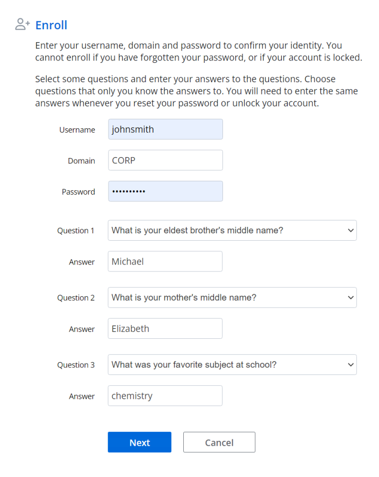

# Using Password Reset

Netwrix Password Policy Enforcer is a web application. Users can access it from a web browser, or from the Password Reset Client. The default URL for the Web Interface is: `http://[server]/pwreset/`  
See the [Password Reset Client](Password Reset Client "Password Reset Client") topic for more information.

You can use URL parameters to open a specific page, and to set the user and domain names. For example: `http://[server]/pwreset/apr.dll? cmd=enroll&username=johnsmith&domain=CORP`

Where [server] is the name or IP address of the server hosting the Web Interface.

Users access the Enroll, Reset, Unlock, and Change features from the menu. These features are explained on the following pages.

**CAUTION:** The connection between the Web Interface and Password Reset Server is always encrypted. Install an SSL certificate on the web server and use HTTPS to encrypt connections from the browser to the web server. See the [Installing and Using an SSL Certificate](Securing Password Reset#_bookmark46 "Installing and Using an SSL Certificate") topic for more information.

## Enroll

Only enrolled users can reset their password and unlock their account. Users can enroll manually by answering some questions about themselves, or they can be enrolled automatically if automatic enrollment is enabled. Users only need to enroll once, but they can enroll again if they are locked out of Password Reset, or if they want to change their questions or answers. See the [Verification Codes](Verification Tab#Verifica "Verification Codes") and [Verification Tab](Verification Tab#Lockout "Lockout") topics for more information.

Follow the steps below to manually enroll into Password Reset.

**Step 1 –** Click the **Enroll** item in the menu.

**Step 2 –** Type a **Username**, **Domain**, and **Password**.

**Step 3 –** Type an e-mail address if the **E-mail** text box is visible. See the [Options](Enroll Tab#Options "Options") topic for more information.

**Step 4 –** Select a question from each of the **Question** drop-down lists, and type an answer to each question in the **Answer** text boxes.

**Step 5 –** Click **Next**, and then click **OK** to return to the menu.

**NOTE:** Windows increments the bad password count in Active Directory when a user tries to enroll with an incorrect password. This may trigger a lockout if the Windows account lockout policy is enabled.

## Reset

Users should use the Reset feature if they have forgotten their password. Resetting a password also unlocks the account if it is locked.

Follow the steps below to reset an account password.

**Step 1 –** Click the **Reset** item in the menu.

**Step 2 –** Type a **Username** and **Domain**, and then click **Next**.

**Step 3 –** Type the **Answer** to the first question, and then click **Next**. Repeat until all questions are answered correctly.

**Step 4 –** You may be asked to enter a verification code. The verification code is sent to your phone by e-mail or SMS. Type the **Code**, and then click **Next**.

**Step 5 –** Type the new **Password** into both text boxes, and then click **Next**.

**Step 6 –** Click **OK** to return to the menu.

## Unlock

Users should use the Unlock feature if they know their password, but have entered it incorrectly too many times and locked out their account.

Follow the steps below to unlock an account.

**Step 1 –** Click the **Unlock** item in the menu.

**Step 2 –** Type a **Username** and **Domain**, and then click **Next**.

**Step 3 –** Type the **Answer** to the first question, and then click **Next**. Repeat until all questions are answered correctly.

**Step 4 –** You may be asked to enter a verification code. The verification code is sent to your phone by e-mail or SMS. Type the **Code**, and then click **Next**.

**Step 5 –** Click **OK** to return to the menu.

**NOTE:** The Unlock feature unlocks accounts in Active Directory. Users who are locked out of Password Reset should re-enroll to gain access to Password Reset. See the [Verification Codes](Verification Tab#Verifica "Verification Codes") topic for more information.

## Change

Users should use the Change feature if they know their password and would like to change it.

Follow the steps below to change an account password.

**Step 1 –** Click the **Change** item in the menu.

**Step 2 –** Type a **Username** and **Domain**, and then click **Next**.

**Step 3 –** Type the **Old Password**, **New Password**, and **Confirm Password**, and then click **Next**.

**Step 4 –** Click **OK** to return to the menu.

**NOTE:** Windows increments the bad password count in Active Directory when a user tries to change their password with an incorrect password. This may trigger a lockout if the Windows account lockout policy is enabled.

## Error Messages

Validation errors are shown in a red box below the page instructions. Validation errors are normally caused by invalid user input. They can often be overcome by changing the value of one or more input fields and resubmitting the form.

Critical errors are shown on their own page. These errors are mostly a result of configuration or system errors. An event may be written to the Windows Application event log on the Password Reset Server computer when a critical error occurs. Users can sometimes overcome a critical error by following the instructions in the error message, but most critical errors are beyond the user's control.

Validation and critical error messages are stored in the HTML templates. You can modify the default messages by editing the templates. See the [Resource Strings](Editing the HTML Templates#_bookmark50 "Resource Strings") topic for more information.