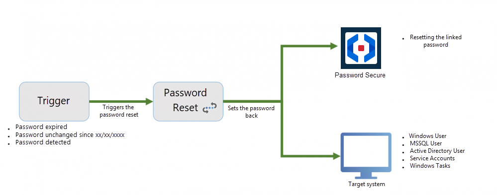

# Password Reset

## What is a Password Reset?

The safest passwords are those that no one knows. A Password Reset enables passwords to be reset to a new and unknown value according to freely definable triggers. A trigger could be a definable time interval or a certain action by the user. **The value of the password is changed in both Netwrix Password Secure and also on the target system.**

This process will be explained below using a specific example. The password for the MSSQL user has expired. The Password Reset changes the password in Netwrix Password Secure and also in the target system to a new value.

NOTE: If an error occurs during the execution of a password reset, the affected reset is blocked with all associated passwords. This is noted in the logbook with an entry "blocked".

**CAUTION:** 
Due to the complexity of the process, it is strongly recommended that Password Reset is configured **in combination with certified partners**. The desired simplification of work processes using the above-mentioned automated functions is accompanied by numerous risks.