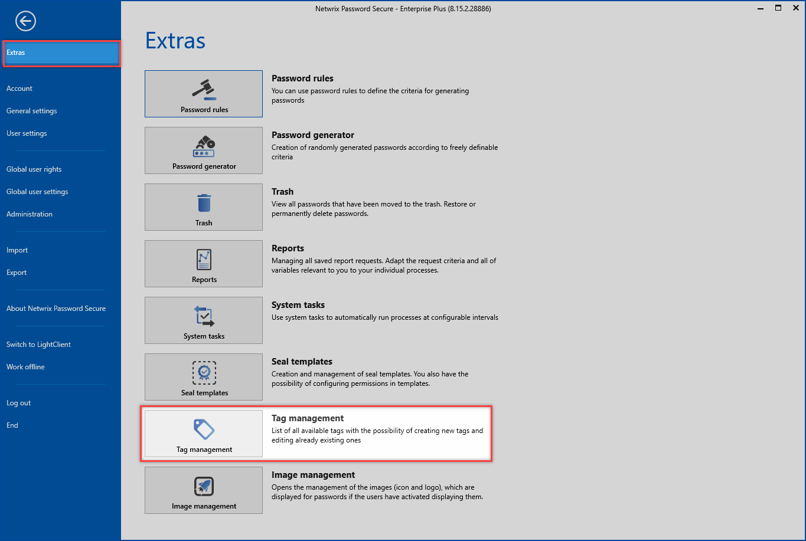

# Tag manager

## What is the tag manager?

All existing tags can be viewed, edited and deleted directly in the tag manager. This can be achieved via the filter, within the “Edit mode” of a data set as well as via the main menu under the group [Extras](../Extras "Extras").

The tag manager itself is a clearly structured tool with which you can view and edit all relevant information. The colours can also be assigned here. The “Number used” column indicates how often an object has been tagged with the tag. In this way, you can keep track of and remove tags that are no longer needed.

## Relevant rights

The following option is required for managing tags

User right

* Manage tags

**CAUTION:** It is only possible to delete tags if there are no more data associated with them