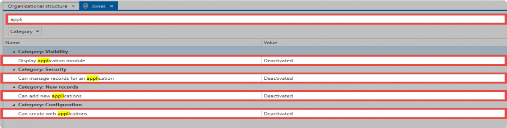

# User rights

## What are user rights?

In the user rights, access to functionalities is configured. Amongst tother things, this category includes both the visibility of individual [Client Module](../../ClientModule/Client Module "Client Module"), as well as the use of the import, export or management of rights templates functions. A complete listing is directly visible in the user rights.

## Administration of user rights

Managing all user rights exclusively at the level of the user would be a time intensive process and thus require a disproportionate amount of care and maintenance. In the same way as with the [Authorization and protection mechanisms](../../../Web Applicaiton/Authorization and protection/Authorization and protection mechanisms "Authorization and protection mechanisms"), an approach can be used in which several users are grouped together. Nevertheless, it must still be possible to additionally address the specific requirements of individual users. Some functionalities, on the other hand, should be available to all users. In order to do this, Netwrix Password Secure offers a three-step concept.

When it comes to user rights, the focus is always on the user. The user can receive user rights in one of the following three ways:

1. The **personal user right** only applies to a specific user. This is always configured via the[Organisational structure](../../ClientModule/OrganisationalStructures/Organisational structure "Organisational structure").

**User rights to role**s apply to all members of a role and are specified in the [Roles](../../ClientModule/Roles/Roles "Roles")

1. The **global user right** applies to all users of a database without exception. You can configure it in the client settings.

How a user receives a user right is irrelevant. The only important thing is that the user actually receives a required right in one of the three ways mentioned above. It is recommended that you link user rights to roles and, if necessary, supplement them with global user rights.

**CAUTION:** In addition to personal and global user rights (as opposed to settings), user rights are assigned via roles and not via organisational units!

NOTE: Only those user rights that the current user possesses themselves can be issued. However, all rights can be removed.

## Configuring the security level

The **security level** is an essential element that is also specified in the user rights. This is the basis for the configuration of the [User settings](../User settings/User settings "User settings").

## Searching within user rights

Due to the large number of possible configurations, the search function helps you to quickly find the desired configuration. This process is based as usual on the List [Search](../../Operation and Setup/Search/Search "Search").

#### Database administrator

Special attention should be given to the right Is database administrator. This right has the following effects:

* The user can also issue rights that he does not possess himself.
* The user can only have their rights removed by other database administrators.
* The user can unlock other users on the Server Manager.
* The user can also remove other users from the rights if they have the owner right.