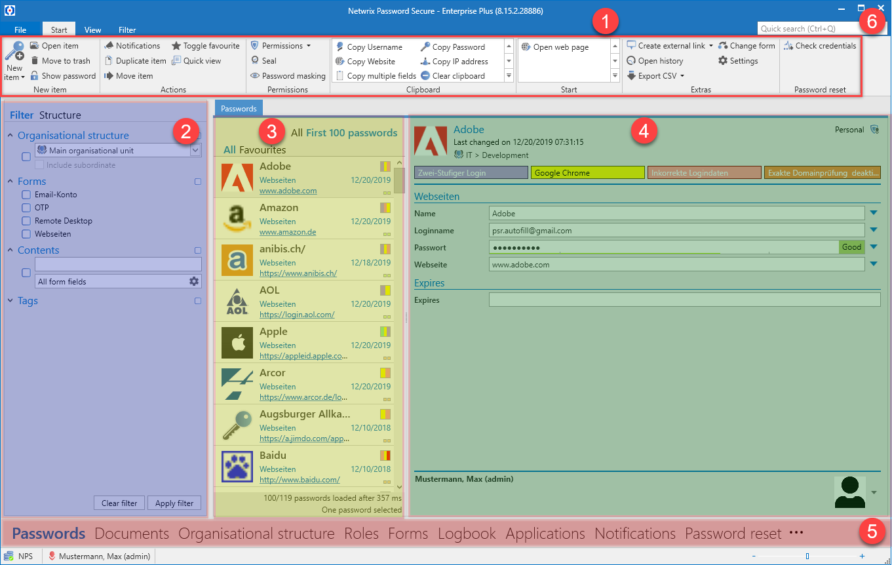

# Operation and Setup

## Client structure

The modular structure of the client ensure that the required functionalities are always in the same place. Although the module selection gives access to the various areas of Netwrix Password Secure, the control elements always remain at the positions specified for this purpose. This intuitive operating concept ensures efficient work and a minimum of training time.

1. [Ribbon](Ribbon/Ribbon "Ribbon")

2. [Filter](Filter/Filter "Filter")

3. [List view](ListView/List view "List view")

4. [Reading pane](ReadingPane/Reading pane "Reading pane")

5. [Tags](Tags/Tags "Tags")

6. [Search](Search/Search "Search")

7. [Dashboard and widgets](Dashboard and widgets/Dashboard and widgets "Dashboard and widgets  ")

## TABs

Tabs offer yet another option within the to present related information in a separate area. This tab navigation enables you to display, quickly access and switch between relevant information. The results for a filter with specific criteria can thus be retained without the original result being overwritten

when a new filter is applied. In parallel, detailed information about records can also be found in their own tabs. It is of course possible to adjust the order of the tabs via drag & drop according to your individual requirements.

#### Standard tab

Depending on the active module, the All passwords tab will be renamed to the corresponding module by default. (All documents, all forms, etc.)

Although the name suggests that all records in the database are displayed, the records displayed in list view correspond to the criteria that have been defined in the filter. The tab closes and can be restored by reusing the filter.

## Client footer information

Independently of the module chosen, various information is displayed in the footer area of the client. The icons are also provided with a meaningful mouse-over text, which provides additional information.

* Connection to database
* Feedback in case connection is insecure
* Last name, first name (user name) of the logged-in user

* [Ribbon](file:/D:/Support/Flare/Word Files/PasswordSecure_Documentation_without_existing_chapters.docx#_bookmark50)
* [Filter](file:/D:/Support/Flare/Word Files/PasswordSecure_Documentation_without_existing_chapters.docx#_bookmark51)
* [List view](file:/D:/Support/Flare/Word Files/PasswordSecure_Documentation_without_existing_chapters.docx#_bookmark54)
* [Reading pane](file:/D:/Support/Flare/Word Files/PasswordSecure_Documentation_without_existing_chapters.docx#_bookmark55)
* [Tags](file:/D:/Support/Flare/Word Files/PasswordSecure_Documentation_without_existing_chapters.docx#_bookmark56)
* [Search](file:/D:/Support/Flare/Word Files/PasswordSecure_Documentation_without_existing_chapters.docx#_bookmark57)
* [Dashboard and widgets](file:/D:/Support/Flare/Word Files/PasswordSecure_Documentation_without_existing_chapters.docx#_bookmark59)
* [Shortcut key](file:/D:/Support/Flare/Word Files/PasswordSecure_Documentation_without_existing_chapters.docx#_bookmark60)

## Orientation

It is possible to change the alignment of the following objects:

* [Active Directory link](../ClientModule/OrganisationalStructures/DirectoryServices/ActiveDirectoryLink/Active Directory link "Active Directory link")
* [Applications](../ClientModule/Applications/Applications "Applications")
* [Notifications](../ClientModule/Notifications/Notifications "Notifications")
* [Reports](../MainMenu/Extras/Reports/Reports "Reports")
* [Documents](../ClientModule/Documents/Documents "Documents")
* [Forms](../ClientModule/Forms/Forms "Forms")
* [Logbook](../ClientModule/Logbook/Logbook "Logbook")
* [Organisational structure](../ClientModule/OrganisationalStructures/Organisational structure "Organisational structure")
* [Password Reset](../ClientModule/PasswordReset/Password Reset "Password Reset")
* [Password rules](../MainMenu/Extras/Password rules/Password Rules "Password rules")
* [Roles](../ClientModule/Roles/Roles "Roles")
* [Seal templates](../MainMenu/Extras/Seal templates/Seal templates "Seal templates")
* [System tasks](../MainMenu/Extras/System tasks/System Tasks "System tasks")
* Forwarding Rules
* Profil picture in the reading pane