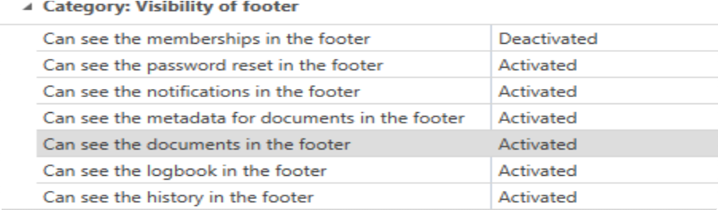

# Reading pane

## What is the reading pane?

The reading pane on the right side of the client always corresponds to the detailed view of the selected record in the list view and can be completely deactivated via the ribbon. In addition, you can configure here the arrangement of the reading pane – either on the right, or underneath the [List view](../ListView/List view "List view").

## Structure of the reading pane

The reading pane is divided into two areas:

1. **Details area**
2. Footer area

1. Details area

Depending on which record you have selected in [List view](../ListView/List view "List view"), the corresponding fields are displayed here. In the header, the assigned [Tags](../Tags/Tags "Tags"), as well as the [Organisational structure](../../ClientModule/OrganisationalStructures/Organisational structure "Organisational structure") are displayed.

**CAUTION:** It should be noted that the details area cannot be used for editing records! Although it displays all of the data, editing is only possible if the record has been opened.

2. Footer area

In the footer area of the reading pane, it is possible to display various information for the currently selected record. The button can be activated via the button provided. It is hidden by default.

The logbook, linked documents, history, notifications and password resets can be accessed separately here via the tabs. The individual elements can be viewed with a double-click, as well as by using the quick view (space bar). Double clicking always opens a separate tab, the quick view merely opens a modal window

Visibility of the individual tabs within the footer section is secured via separate [User rights](../../MainMenu/User rights/User rights "User rights"):

The same options can also be found in the settings. A tab is only displayed if it has been activated both in the rights and also in the settings. This makes it possible to specify (for example via the administrator) whether a user is permitted to view the tab or not. The user can then define themselves which tabs they want to be displayed.