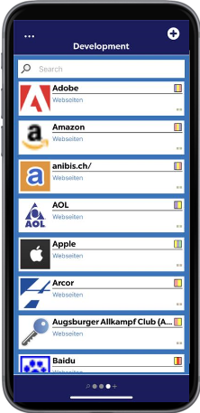

# Password Management

In principle, there are two types of passwords. **Global** and **personal** passwords.

#### Global passwords

Global passwords are passwords that are assigned to an organizational unit. These passwords are usually used by more than one user.

Prerequisites

The following prerequisites must be met in order to create new global passwords:

* User right **Can create new passwords**
* **Add right** to the corresponding organizational unit

#### Personal passwords

Personal passwords are passwords to which only the creating user is authorized.

Requirement

The following user rights are required to create personal passwords:

* Can create new passwords
* Can create personal records

#### Create passwords

When creating a new record, it is necessary to know whether it is a personal or a global password. Because according to this criterion you should select the appropriate tab and click on the + located in the upper right corner.

After that, select the required **form**.

Then, once you have filled in all the relevant information of the selected form, one click on **Save** is enough to create the password.

#### Editing passwords

To edit a password, click on the corresponding password and select the pencil icon.

As soon as you click on the pencil icon again in the new window, in the so-called read-only view, you can edit all existing fields.

#### Delete

Passwords can currently only be deleted via the Full- or Web Application.

#### Tags

Tags can be added or removed both when creating and editing a password.

It is also possible to create a completely new tag.

This is possible by searching in the tag selection in the search field for a tag that does not already exist.

You will then be offered the option of creating this previously non-existent tag.

