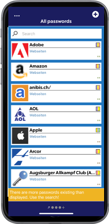
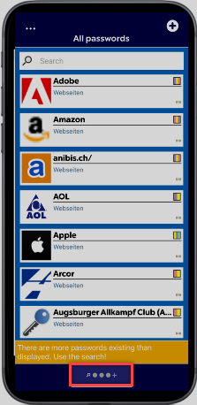

# Tabs

Once you have successfully logged in, you will find yourself in the view where all the user's passwords are located.

Here you have the following options:

Action menu

With a click on  the action menu is opened.

The following actions are offered:

* **Open settings** (more information can be found in the Settings chapter).
* **Close tab** (the option is offered only if you are in one of the organizational units tabs. The default ones are excluded)
* **Logout** (you will be logged out from the database)
* **Cancel** (closes the action menu and returns to the tab view)

Tabs

Below the passwords there is a bar for managing tabs.

By clicking on the plus sign there is a possibility to add more tabs.

These tabs are organizational units that the user can see. By default, the tabs **"All passwords"** and **"Personal"** are stored.