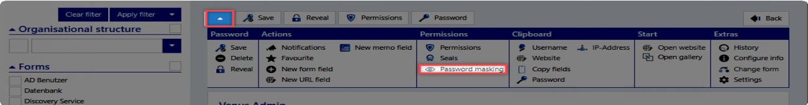
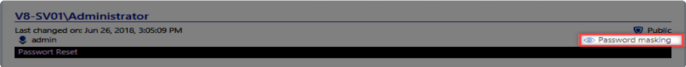

# Authorization and protection mechanisms

## Security and protection on the Web Application

As with the client, the records can be protected on the Web Application with different mechanisms. The authorizations on records can also be managed in the Web Application. During the development of the Web Application, there was always taken care that the operation is identical to the operation of the client. Since the Web Application is based on HTML, it is unfortunately not possible to render the client 100% identical. Therefore, the operation may differ in details. These deviations should be clarified in this chapter.

#### Permissions and rights concept

###### Protections

Password masking

The password masking follows the familiar logic of the client. Due to this function, reference should be made to the chapter of [Password masking](../../Advanced view/PermissionConcept/Predefining rights/Protective mechanisms/Password masking/Password masking "Password masking").

There are marginal differences in the operation. The privacy protection is fixed or edited via a button in the extended menu..

The corresponding button is only displayed if the logged in user has the sufficient rights.

If a record is provided with a privacy protection, this is shown in the header of the password.

Seal

The seals also correspond in function to the known logic of the client. In the chapter seal further explanations can be found. The [Seals](../../Advanced view/PermissionConcept/Predefining rights/Protective mechanisms/Seals/Seals "Seals") are configured in the extended menu via a button.

The button is only displayed for the users who have the rights to edit seals. If a record is sealed, this will be shown in the password field.

