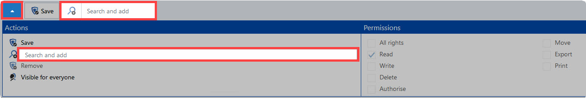

# Organisational structure module

The following functions are currently available in the **organisational structure module**:

* Adding/editing/deleting/authorizing users / organisational structures
* Notifications
* Drag & Drop
* Filter
* Quick view
* User settings
* User rights
* Changing passwords
* Print

NOTE: The Web Application module organisational structure is based on the client module of the same name. Both modules have a different scope and design but are almost identical to use.

## AD connection in the Web Application

The Active Directory connection in the Web Application works similiar to the Client. In the chapter [Active Directory link](../../../Advanced view/ClientModule/OrganisationalStructures/DirectoryServices/ActiveDirectoryLink/Active Directory link "Active Directory link") you can find further information.

The Web Application offers the following functions:

* Import
* Manual synchronisation
* Manage profiles

###### Radius

You can reach the Radius server, if the import is in the Masterkey mode. The Radius server will be provided in the Active Directory profile and will therefore deliver the possible authentication methods in future. You will find further informations in the [RADIUS authentication](../../../Advanced view/ClientModule/OrganisationalStructures/DirectoryServices/ActiveDirectoryLink/RADIUS authentication "RADIUS authentication") chapter.

###### Predefining rights

To **predefine rights** in the Web Application, the procedure is the same as in the Client. [Predefining rights](../../../Advanced view/PermissionConcept/Predefining rights/Predefining rights "Predefining rights"))

Go to the module organisational structure to choose the organisation unit for which the rights shall be predefined. Then choose **Predefine rights** in the menu bar.

**Creating the first template group:** A modal window will appear after clicking on the icon for adding a new template group (green arrow) in which a meaningful name for the template group should be entered.

Now you can add the appropriate roles and users.

You can add users and roles in different ways:

* Add the appropriate roles and users at the toolbar under **Search and add**.
* Click on the loupe to see all the users and roles.

