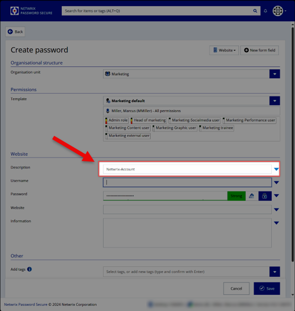

# Create a New Entry from Scratch

Follow the steps to create a new entry from scratch.

Step 1 – First, click *Create new password* on the upper left in Netwrix Password Secure.

Step 2 – A form will open. Now choose the form you need, such as "Website," on the upper right. See the form drop-down list in the screenshot below.

Step 3 – Let`s fill out the website form in this example.

* Choose the organization unit you want to save the password in like the department.

* Choose a permission template to define who else can see your password.

* Set a description for your stored password.

* Enter the username or email address needed for login.

* Enter the password manually or use the password generator by clicking on the button in the middle (high number). The password generator will open.

NOTE: To learn more about the generating of passwords, see the [Clean up Your Passwords](CleanUpPasswords "Clean up Your Passwords") topic for additional information.

NOTE:  By clicking on the **lock icon** right to the password generator, you can mask and unmask your password.

* Enter the website URL that leads to the login.

* Add one or more tags to categorize your password and find it easier (i.e., "HR" or "Internet").

Step 4 – Click **Save**, and you are done!