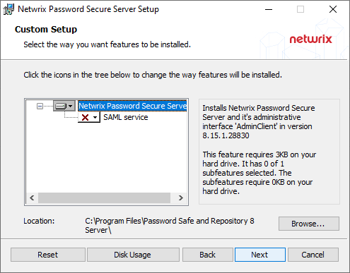

# Installation Server Manager

## Guide

The MSI installation files and the associated [Application server](../Requirements/Application server "Application server") can be found in the corresponding sections. The following step-by-step guide will accompany you through the wizards.

First you are required to read and accept the license terms. These can also be printed.

The next step is to define the location. The suggested location can be retained.

If you want to use Netwrix Password Secure as an identity provider [Configuration of SAML](../../Configuration/Advanced view/ClientModule/Applications/Configuration of SAML/Configuration of SAML "Configuration of SAML") must be selected. Otherwise, it will not be installed.

Start the installation.

The last step closes the setup and opens (if desired) the Server Manager.

## Authentication

After the installation, you can login directly to the Server Manager.

NOTE: The initial password for the first login is “admin”. It should be changed directly after the logon.