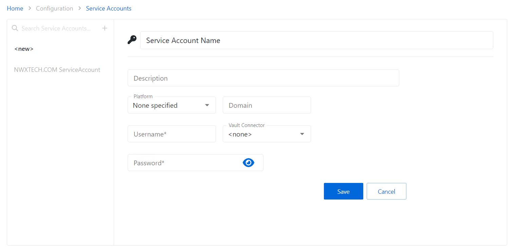

# Add Service Account

Follow the steps to add a service account to the console.

**Step 1 –** Navigate to the Configuration > Service Accounts page.

**Step 2 –** In the Service Account list, click the Plus icon.

**Step 3 –** Enter the applicable information. See the [Service Accounts Page](../Page/ServiceAccounts "Service Accounts Page") section for detailed descriptions of the fields.

* For service accounts checked out through a vault connector, select a previously added vault connector from the drop-down list. See the [Bring Your Own Vault (BYOV) Integration](IntegrationBYOV) Integration section") topic for additional information.

**Step 4 –** Click Save to create the new service account.

The new service account is added to the Service Accounts list.