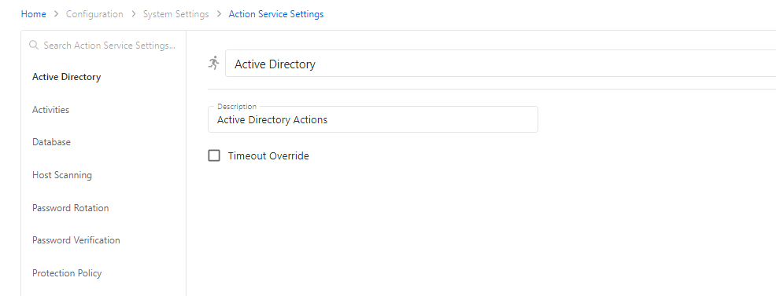

# Action Service Settings Page

The Action Service Settings page is accessible from the Navigation pane under Configuration > System Settings. It shows all action service settings to customize or override action timeout.

The Action Service Settings page has the following features:

* Description — Description of the policy
* Timeout Override — Check this box to expose the current timeout override option
* Timeout Override (minutes) — Enter a time (in minutes) to customize or override the current action service timeout limit