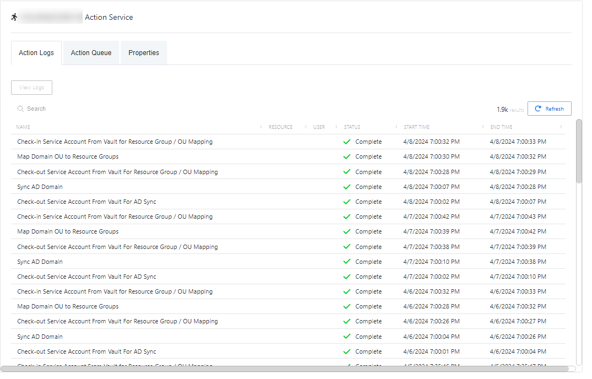

# Action Service

On the Action Services page, view or modify action services.

The Action Service page shows details of the selected action service and has the following features:

* Name – Name of the selected action service
* [Action Logs Tab](#_Action_Logs_Tab_1 "Jump to the Action Logs Tab section")
* [Action Queue Tab](#Action)
* [Properties Tab](#_Properties_Tab_1 "Jump to the Properties Tab section")

## Action Logs Tab

The Action Logs tab shows the event logs for the action service.

The Action Logs table has the following features:

* Search – Searches the Name column to match the search string. When matches are found, the table is filtered to the matching results.
* The Action Logs table has two buttons:

  * View Logs – View additional log information for the selected action
  * Refresh – Reload the information displayed
* Column headers can be sorted by ascending or descending order:

  * Name – Name of the action processed
  * Resource – The resource the action will run on
  * User – The account associated with the action
  * Status – Shows status information for the action:

    * Complete – Action completed successfully
    * Failed – Action failed
  * Start Time – Indications when the action started
  * End Time – Indications when the action completed

## Action Queue Tab

The Action Queue tab shows the tasks to be executed by the action service.

The Action Queue table has the following features:

* Search – Searches the Name column to match the search string. When matches are found, the table is filtered to the matching results.
* The Action Queue table has two buttons:

  * View Logs – View additional log information for the selected action
  * Refresh – Reload the information displayed
* Column headers can be sorted by ascending or descending order:

  * Name – Name of the action to be executed
  * Resource – The resource the action will run on
  * User – The account associated with the action
  * Status – Shows status information for the action:

    * Complete – Action completed successfully
    * Failed – Action failed
  * Start Time – Indications when the action started
  * End Time – Indications when the action completed

## Properties Tab

The Properties tab shows additional information about the action service.

The Properties table has the following features:

* Column headers can be sorted by ascending or descending order:

  * Name – Property of the Action Service and its host
  * Value – Value of the Action Service / host property