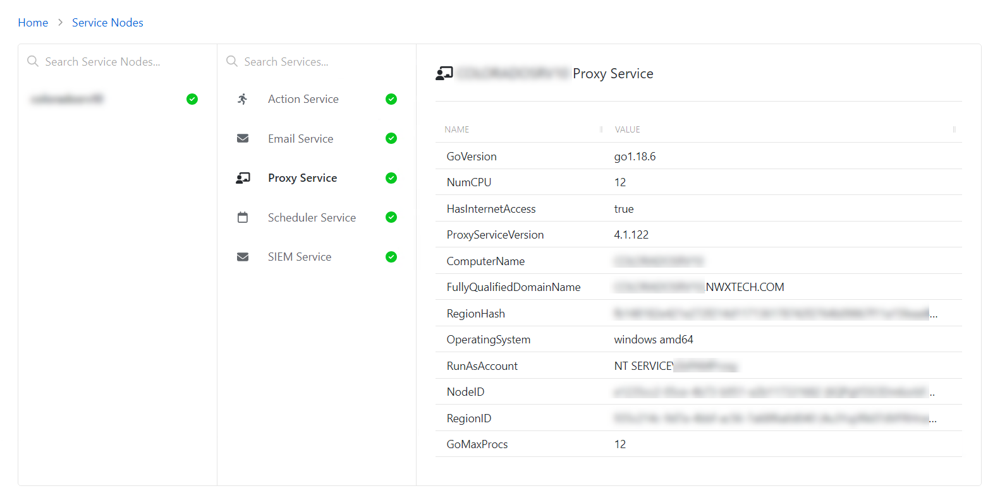

# Proxy Service

The Proxy Service page shows the details of the selected service on the host.

The Proxy Service page lists the properties for the selected proxy service:

* Name – Property name
* Value – Property value