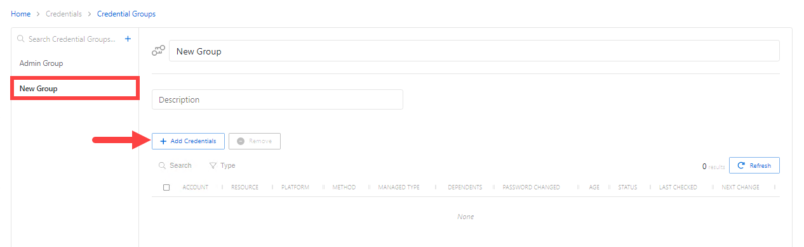

# Add Credential Groups

Follow the steps to add credential groups to the Privilege Secure Console.

**Step 1 –** Navigate to the Policy > Credentials > Credential Groups page.

**Step 2 –** In the Credential Groups list, click the Plus icon.

**Step 3 –** Enter or select the following information:

* Name — Displays the name of the credential
* Description — Description of the policy

**Step 4 –** Click Save to create the new credential group.

**Step 5 –** With the new credential group selected, click the **+ Add Credentials** button to open the Add Credentials window.

**Step 6 –** Select the checkbox for the credential and click **Add** to save the credential to the Credential Group. See the [Add Credentials to a Credential Group](../Window/Credentials/AddCredentials#Add "Add Credentials to a Credential Group") topic for additional information.

The new credential group is added to the console and is shown in the Credential Groups list.