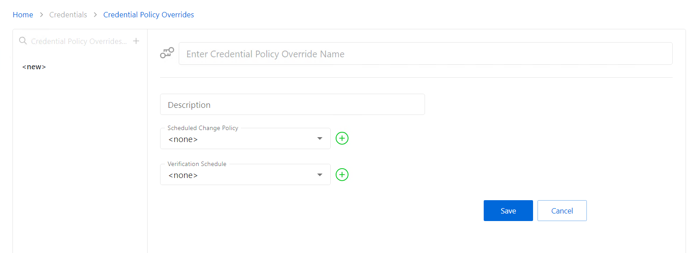

# Add Credential Policy Override

Follow the steps to add Credential Policy Override to the Privilege Secure Console.

**Step 1 –** Navigate to the Policy > Credentials > Credential Policy Overrides page.

**Step 2 –** In the Credential Policy Overrides list, click the Plus icon.

**Step 3 –** Enter or select the following information:

* Name — Displays the name of the credential
* Description — Description of the policy
* Scheduled Change Policy — Select a previously added schedule policy from the drop-down list. How often the credentials for a managed account are changed (credential rotation). See the [Credentials Dashboard](../../Dashboard/Credentials#_Activities_Tab_1 "Jump to the Credentials Dashboard section") and [Schedule Policies Page](../Page/SchedulePolicies "Schedule Policies Page") topic for additional information.
* Verification Schedule — How often to verify the credentials for managed accounts on the resources defined by the selected platform. See the [Credentials Dashboard](../../Dashboard/Credentials#_Activities_Tab_1 "Credentials Dashboard") topic for additional information on managed accounts.

**Step 4 –** Click Save to create the new credential policy override.

**Step 5 –** With the new Credential Policy Override selected, click the **Add Credentials** button to open the Add Credentials window. See the [Add Credentials to a Policy Override](../Window/Credentials/AddCredentials#Add2 "Add Credentials to a Policy Override") topic for additional information.

**Step 6 –** Select the checkbox for the credential and click **Add** to save the credential to the Credential Policy Override.

**NOTE:** In order for an account to be added to add credentials window, a credential must be managed with a method of **Automatic**. Only one account can be added to a Credential Policy Override at a time. See the [Manage Internal Service Accounts](../Window/Credentials/ManageInternalServiceAccount "Manage Internal Service Accounts") topic for additional information.

The account is added to the console and is shown in the Credential Policy Overrides list.