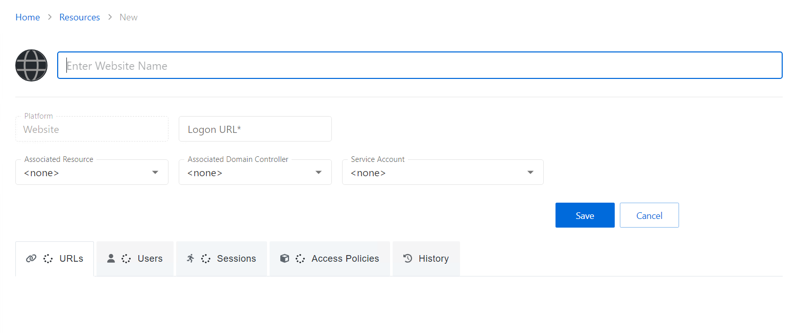

# Add New Website

Follow the steps to add a Website Resource to the Privilege Secure Console.

**Step 1 –** Navigate to the **Policy** > **Resources** page.

**Step 2 –** Click the Plus icon and select New Website from the drop-down list.

**Step 3 –** Enter the following information:

* Website Name – Displays the name to be displayed in the Resource list for the website
* Platform – Website (This field cannot be changed.)
* Logon URL – Enter the primary logon page for the website. This is only used if no URL is specified when defining a website Activity.
* Associated Resource – *(optional)* If the website is hosted on a server that is also managed by Privilege Secure, select the resource from the drop-down list to ensure that AD account operations are performed on the domain controller the website resource is bound to
* Associated Domain Controller – *(optional)* A specific domain controller may be selected to ensure that AD account operations are performed on a domain controller the website will reference for authentication
* Service Account – *(optional)* The service account used when activity *actions* require a provisioned account to interact with the resource, e.g. custom PowerShell. From the drop-down menu, select a previously added service account. See the [Service Accounts Page](../../Configuration/Page/ServiceAccounts "Service Accounts Page") topic for additional information.

  * Add New Service Account — Open the Add New Service Account window. The fields are identical to those on the Service Accounts page

**Step 4 –** Click **Save** to add the website to the console.

The new website has been onboarded. See the [Website Details Page](../Page/Details/Website "Website Details Page") topic for additional information.