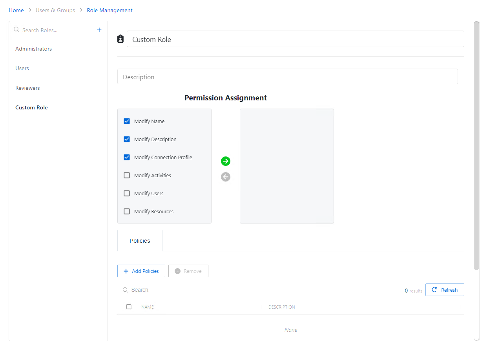

# Change Permission Assignment

Follow the steps to add or remove permission assignments from a custom role.

**Step 1 –** Navigate to the Policy > **Users & Groups** > **Role Management** page.

**Step 2 –** Click a custom role item from the left-hand menu.

**Step 3 –** From the left-hand menu, check the boxes of one or more permissions to add to this custom role. Click the add selections Green Arrow.

**Step 4 –** (Optional) From the right-hand menu, check the boxes of one or more permissions to remove from this custom role. Click the remove selections Red Arrow.

Selected permissions have been added or removed from the custom role. See the [Custom Role Details Page](../Page/Details/RoleManagementCustom "Custom Role Details Page") topic for additional information.