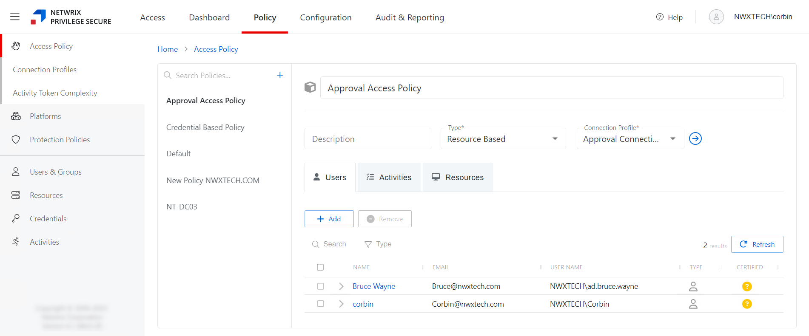

# Policy Interface

The Policy interface provides users with options for creating access policies, investigating activity sessions, onboarding and managing users, groups, resources, and credentials. This topic explains the interface features and how to use them.

Select the Policy interface for related pages:

* [Access Policy Page](Page/AccessPolicy "Access Policy Page") — Add or modify user and group access to resources

  * [Connection Profiles Page](Page/ConnectionProfiles "Connection Profiles Page") — Add or modify connection profiles
  * [Activity Token Complexity Page](Page/ActivityTokenComplexity "Activity Token Complexity Page") — Add or modify the complexity of activity tokens
* [Platforms Page](Page/Platforms/Overview "Platforms Page") — Add or modify the platforms used

  * [Password Complexity Page](Page/PasswordComplexity "Password Complexity Page") — Configure the password complexity rules for the platform resources
  * [Schedule Policies Page](Page/SchedulePolicies "Schedule Policies Page") — Add or modify schedules for tasks and policies
* [Protection Policies Page](Page/ProtectionPolicies "Protection Policies Page") — Add or modify protection policies
* [Users & Groups Page](Page/UsersGroups "Users & Groups Page") — Add or modify users, groups, and applications

  * [Role Management Page](Page/RoleManagement "Role Management Page") — Add or modify roles for users and groups
  * [User and Group Collections Page](Page/UserGroupCollections "User and Group Collections Page") — Add or modify user and group collections
* [Resources Page](Page/Resources "Resources Page") — Add or modify resources

  * [Resource Groups Page](Page/ResourceGroups "Resource Groups Page") — Add or modify resource groups
* [Credentials Page](Page/Credentials "Credentials Page") — Add or modify credentials

  * [Credential Groups Page](Page/CredentialGroups "Credential Groups") — Add or modify credential groups
* [Activities Page](Page/Activities "Activities Page") — Add or modify activities

  * [Activity Groups Page](Page/ActivityGroups "Activity Groups Page") — Add or modify activity groups