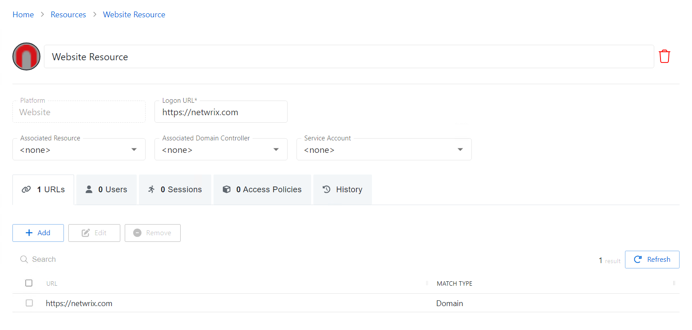

# Website Details Page

The Website Details page shows additional information for the selected website resource. This page is opened from any linked resource within the various interfaces.

The details page shows the following information:

* Name — Displays the name of the resource
* Trashcan icon — Removes the selected resource from being managed by the application. A confirmation window will display.
* Platform — Displays the type of platform, which defines the resource
* Logon URL — Displays the primary logon page. This is only used if no URL is specified when defining a website activity.
* Associated Resource — If the website is hosted on a server that is also managed by Privilege Secure, it may be associated to the website management. This ensures that AD account operations are performed on the domain controller the website resource is bound to.
* Associated Domain Controller — A specific domain controller may be associated to the website management. This ensures that AD account operations are performed on a domain controller the website will reference for authentication.
* Service Account — Displays the service account associated with the resource
* Blue arrow button — Opens the Service Account details page. See the [Service Accounts Page](../../../Configuration/Page/ServiceAccounts "Service Accounts Page") topic for additional information.
* Green plus button — Opens the Add New Service Account window. See the [Add New Service Account Window](../../Window/Resources/AddNewServiceAccount "Add New Service Account Window") topic for additional information.

If any of these settings are modified, Save and Cancel buttons are displayed. Click **Save** to commit the modifications. Click **Cancel** to discard the modifications.

The details page has the following tabs:

* [URLs Tab for Website](../../Tab/Resources/URLsWebsite "URLs Tab for Website")
* [Users Tab for Website](../../Tab/Resources/UsersWebsite "Users Tab for Website")
* [Sessions Tab for Website](../../Tab/Resources/SessionsWebsite "Sessions Tab for Website")
* [Access Policies Tab for Website](../../Tab/Resources/AccessPoliciesWebsite "Access Policies Tab for Website")
* [History Tab for Website](../../Tab/Resources/HistoryWebsite "History Tab for Website")