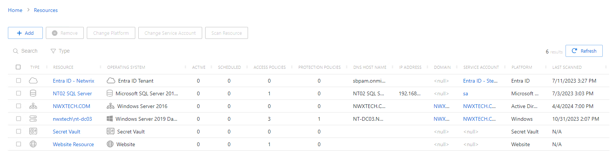

# Resources Page

The Resources page shows information for onboarded resources, such as active and scheduled sessions, policies, and service accounts for the host resources and domain resources that have been added to the console. The Resources page displays the same information as the [Resources Dashboard](../../Dashboard/Resources "Resources Dashboard").

The Resources table has the following features:

* Search — Searches the table or list for matches to the search string. When matches are found, the table or list is filtered to the matching results.
* Filter — Provides options to filter results based on a chosen criterion:

  * Type— Filter by the type of resource: All, Host, Domain, Website, Azure AD, Secret Vault, or Database. The drop-down menu the definition for each Type icon used in the table.
* Add — Opens a list of available resources to add. The Add list contains the following options:

  * New Server — Opens the Add Resources window to onboard new servers. See the [Add Resources Window](../Window/Resources/AddResourcesOnboard "Add Resources Window") topic for additional information.
  * New Domain — Opens the Domain Details page for a new domain. See the [Add New Domain](../Add/Domain "Add New Domain") topic for additional information.
  * New Website — Opens the Website Details page for a new website. See the [Add New Website](../Add/Website "Add New Website") topic for additional information.
  * New Microsoft Entra ID (formerly Azure AD) Tenant — Opens the Microsoft Entra ID Tenant Details page for a new tenant. See the [Add New Microsoft Entra ID Tenant](../Add/EntraIDTenant "Add New Microsoft Entra ID Tenant") topic for additional information.
  * New Secret Vault — Opens the Secret Vault Details page for a new vault. See the [Add Secret Vault](../Add/SecretVault "Add Secret Vault") topic for additional information.
  * New Database — Opens the Databse Details page for a new database. See the [Add New Database](../Add/Database "Add Database")topic for additional information.
* Remove — Removes the selected resource from being managed by the application. A confirmation window will display. See the [Remove Resource Window](../Window/Resources/RemoveResource "Remove Resource Window") topic for additional information.
* Change Platform — Opens the Change Platform window to modify the type of platform for the selected host resource. See the [Change Platform Window](../Window/Resources/ChangePlatform "Change Platform Window") topic for additional information.
* Change Service Account — Opens the Change Service Account window to modify the service account associated with the selected host resource. See the [Change Service Account Window](../Window/Resources/ChangeServiceAccount "Change Service Account Window") topic for additional information.
* Scan Resource — Scans a host resource for local users, groups, windows services, and scheduled tasks. A confirmation window will display.. See the [Platforms Page](Platforms/Overview "Platforms Page") topic for additional information.
* Refresh — Reload the information displayed

The table has the following columns:

* Checkbox — Check to select one or more items
* Type — Icon indicates the type of object
* Resource — Displays the name of the resource. Click the link to view additional details. The details vary based on the type of resource.

  * [Host Details Page](Details/Host "Host Details Page")
  * [Domain Details Page](Details/Domain "Domain Details Page")
  * [Website Details Page](Details/Website "Website Details Page")
  * [Microsoft Entra ID Details Page](Details/EntraID "Microsoft Entra ID Details Page")
  * [Secret Vault Details Page](Details/SecretVault "Secret Vault Details Page")
  * [Database Details Page](Details/Databases "Database Details Page")
* Operating System — Displays the operating system of the resource
* Active — Displays the number of active sessions on the resource
* Scheduled — Displays the number of sessions scheduled for the resource
* Access Policies — Displays the number of access policies associated with the resource
* Protection Policies — Displays the number of protection policies associated with the resource
* DNS Host Name — Displays the DNS host name for a host resource or the FQDN for a domain resource
* IP Address — Displays the IP address for the resource
* Domain — Displays the domain name for the resource. Click the link to view additional details. See the [Domain Details Page](Details/Domain "Domain Details Page") topic for additional information.
* Service Account — Displays the service account associated with the resource. Click the link to view additional details. See the [Service Accounts Page](../../Configuration/Page/ServiceAccounts "Service Accounts Page") topic for additional information.
* Platform — Displays the type of platform, which defines the resource. See the [Platforms Page](Platforms/Overview "Platforms Page") topic for additional information.
* Last Scanned — Date timestamp for the last time the resource was scanned

The table columns can be resized and sorted in ascending or descending order.