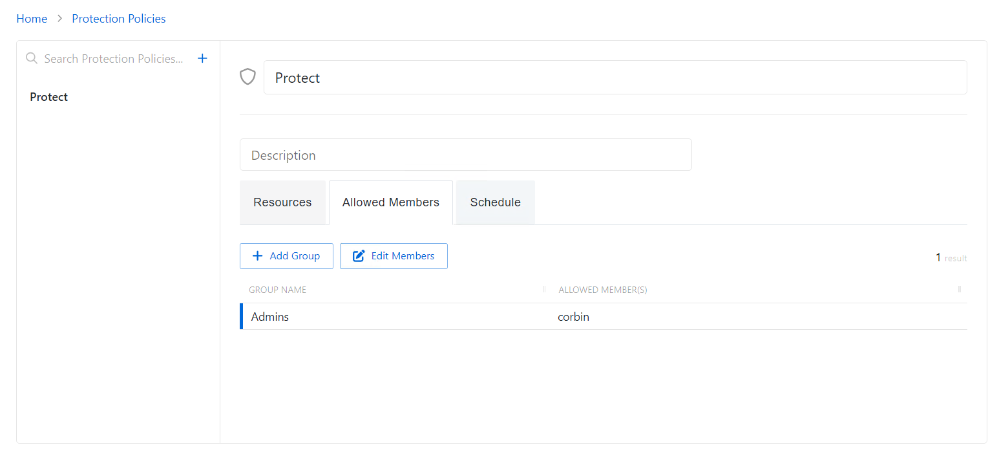
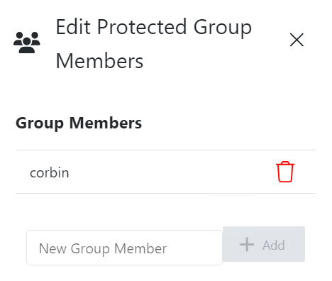

# Allowed Members Tab for Protection Policies

The Allowed Members tab shows the configuration options for managing the groups governed by the selected protection policy. Any group member(s) discovered that are not in the list will be removed from the local group on the resource during the next scheduled sync.

The Allowed Members tab has the following features:

* Add Group — Opens the Add Protected Group and Member window. See the [Add Groups to a Protection Policy](#Add3 "Jump to the Add Groups section") topic for additional information.
* Edit Members — Opens the Edit Protected Group Members window to edit the selected group within the protection policy. See the [Edit Protected Group Members](#Edit "Edit Protected Group Members") topic for additional information.

The table has the following columns:

* Group Name — Displays the name of the group
* Allowed member(s) — Authorized account that will not be removed from the local group when the protection policy runs. If a domain is not specified in the name, the account is assumed to be local to the resource.

### Add Groups to a Protection Policy

Follow the steps to add local groups to the selected protection policy.

**Step 1 –** Navigate to the Policy > Protection Policies page.

**Step 2 –** In the Protection Policy list, select the name of the protection policy and select the Allowed Members tab.

**Step 3 –** Click Add Group to open the Add Protected Group and Member window.

**Step 4 –** Enter the following information:

* Group Name – Displays the name of the group.

  **NOTE:** Privilege Secure cannot be used to create a group. The group must already exist on the resource.
* Group Member – The name of the group member

**Step 5 –** Click Save to add the group to the protection policy.

The new group is added to the protection policy and is shown on the Allowed Members Tab for Protection Policies. When the resource is scanned, any group members not permitted by the protection policy will be removed from the local group on the resource.

### Edit Protected Group Members

Follow the steps to edit the members of a local groups within the selected protection policy.

**Step 1 –** Navigate to the Policy > Protection Policies page.

**Step 2 –** In the Protection Policy list, select the name of the protection policy and select the Allowed Members tab.

**Step 3 –** Click Edit Members to open the Add Protected Group and Member window.

**Step 4 –** Click the Trashcan icon next to a member to remove them from a Protected Group. A confirmation window will appear.

**Step 5 –** (Optional) Enter a Group Member in the provided field.

**Step 6 –** Click Add.

Members of the Protected Group have been edited for this protection policy.