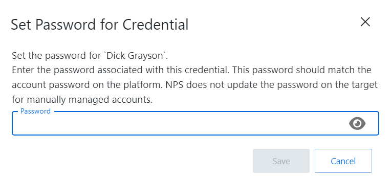

# Manage Internal Service Accounts

An internal service account is a type of service account used by Privilege Secure with no dependencies (windows services or scheduled tasks). When an internal service account (Managed Type *Internal*) is selected and set to be managed by Privilege Secure, a pop up window will display and Privilege Secure searches for a matching user.

If a matching user is found, there are three options to manage the selected account.

* Automatic — Manages the account and password automatically
* Manual — Manages the account and password manually
* Cancel — Closes the window with no changes to the account

If the message “No matching user found” is displayed, Privilege Secure is unable to find a matching user in Active Directory.

Try the following possible solutions to resolve:

* Perform an AD Sync to collect the latest AD data from the domain. See the [Domain Details Page](../../Page/Details/Domain "Domain Details Page") topic for additional information.
* Check the user is added to the Privilege Secure console. See the [Users & Groups Page](../../Page/UsersGroups "Users & Groups Page") topic for additional information.
* Check the spelling of the Username associated with the service account. See the [Service Accounts Page](../../../Configuration/Page/ServiceAccounts "Service Accounts Page") topic for additional information.
* Make sure the user is in Active Directory in the expected domain

## Manually Manage an Internal Service Account

If the manual option is selected, a new window will open to set the password for the credential.

After the password is created, click **Save** to update the password. The account password has been updated and the service account can be manually managed.

The selected account will now display the following options.

* Set Password icon — Opens the Set Password for Credential window to set a new password for the selected account.
* Clipboard icon — Copies the password for the selected account
* Information icon — Opens the View Password window to view the password and copy it to the clipboard. The window stays open for 20 seconds. See the [View Password Window](ViewPassword "View Password Window") topic for additional information.