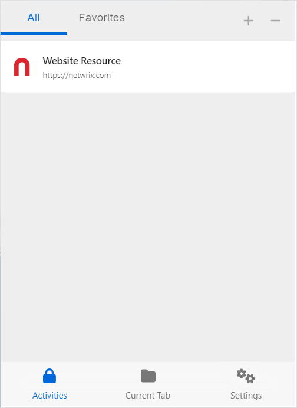
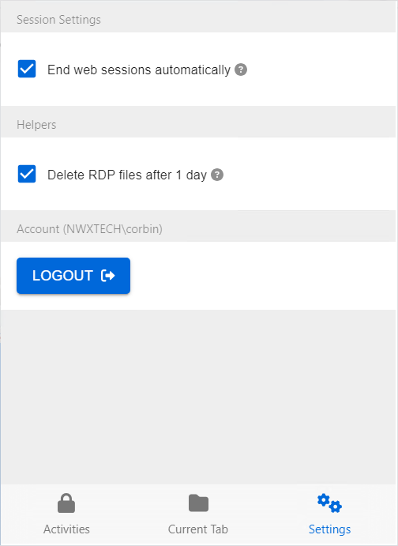

# Browser Extension Interface

The browser extension interface can be launched at any time with the Netwrix Privilege Secure icon in the browser. See the [Log Into the Privilege Secure Console](../../Admin/Login "Log into the Privilege Secure Console") topic for additional information.

The browser interface has 3 tabs:

* [Activities Tab for the Browser Extension](#Activiti "Activities Tab for the Browser Extension")
* [Current Tab for Browser Extension](#Current "Current Tab for Browser Extension")
* [Settings Tab for Browser Extension](#Settings "Settings Tab for Browser Extension")

## Activities Tab for the Browser Extension

The Activities tab displays all website activities mapped to the user via the Privilege Secure Access Policies. See the [Access Policy Page](../../Admin/Policy/Page/AccessPolicy "Access Policy Page") topic for additional information.

The Activities tab has the following features:

* + / - buttons (top right) — Expand or collapse all Resource Activities
* Resources list — Shows all resources mapped to the user via an access policy. Click a Resource to expand it and show associated Activities.

  * Activities — Click an Activity to start an Activity Session. See the [Start Web Session](StartWebSession "Start Web Session") topic for additional information.
  * Favorite icon — Click the favorite icon to move the Activity to the top of the list.
  * Settings icon — Click to open the browser extension settings
  * Session icon — If a session is active, the following icons are shown (see the [Start Web Session](StartWebSession "Start Web Session") topic for additional information):

    * Green icon – Select to launch the web session
    * Red icon – Select to end the current web session

## Current Tab for Browser Extension

The Current tab displays any website activity matching the current URL in the browser.

The Current tab shows the resource that matches the current URL at the top, with all of the activities available for that resource expanded. It has the following features:

* Activities — Click an Activity to start an Activity Session. See the [Start Web Session](StartWebSession "Start Web Session") topic for additional information.
* Favorite icon — Click the favorite icon to move the Activity to the top of the list.
* Settings icon — Click to open the browser extension settings

## Settings Tab for Browser Extension

Configure basic settings for the browser extension. For additional settings, log in to the Privilege Secure Console.

The Settings tab has the following features:

* End web sessions automatically — If selected, Activities will automatically close if there are no active web sessions in any tab
* Delete RDP files after 1 day — If selected, temp files downloaded into the download folder as part of Privilege Secure RDP sessions will be removed after 1 day
* Logout button — Logout of the browser extension