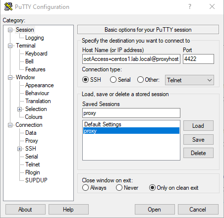
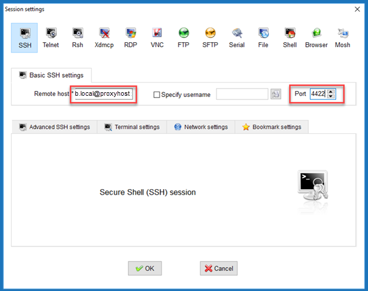

# Configure DirectConnect for Remote Desktop Connection

The Netwrix Privilege Secure proxy service can be used to launch DirectConnect sessions via third-party Remote Desktop Connection Management software. Passing a DirectConnect string to the proxy server will launch an RDP connection. This topic explains the formatting for the connection string, with specific examples given for some popular Remote Desktop Connection Management programs.

**NOTE:** If a SAML or OIDC authentication connector is enabled for the requesting user, DirectConnect functionality cannot be used.

To configure the remote connection client, use a connection string with the following parameters, separated by “+” to the appropriate port on the proxy:

* Username – The user name used to sign into Active Directory in the following format: domain\username, user@domain, user@domain.suffix
* Activity – The activity to perform
* Resource – The DNS host name of the resource to run the activity on
* **Access Policy (optional)** – The Access Policy to invoke (if more than one)
* **Notes (optional)** – User notes about the session

Connection String Format:

++++

Connection String Example:

Netwrix\JonSmith+Local Admin+SQL1.netwrix.com

JonSmith@netwrix.com+Local\_Admin+SQL1.netwrix.com

Note that some clients require you to use the *“\_”* (underscore) character as a replacement for a space in Activity names that are made up of multiple words, for example:

Netwrix\JonSmith+Add\_to\_Local\_Administrators+SQL1

If you wish to add notes, make sure to add the appropriate number of “+” delimiters if you are not defining an access policy:

Netwrix\JonSmith+Local Admin+SQL1.netwrix.com++Server Maintenance

## PuTTY (SSH)

Configuration parameters for PuTTY (SSH).

Host Name Format:

* @

Host Name Example:

* Netwrix\JonSmith+rootAccess+centos1.lab.local@sbpamhost

Port:

* Port – The SSH listening port on the proxy
* Default port – 4422

## MobaXterm (SSH)

Configuration parameters for MobaXterm (SSH).

Remote Host Format:

* @

Resource Host Example:

Netwrix\JonSmith+rootAccess+centos1.lab.local@sbpamhost

Port:

* Port – The SSH listening port on the proxy
* Default port – 4422

Uncheck the checkboxes under Advanced SSH Settings and Bookmark Settings.

|  |  |
| --- | --- |

## MobaXterm (RDP)

Configuration parameters for MobaXterm (RDP).

Remote Host:

* 

Example:

sbpamhost

Username:

* 

Example:

Netwrix\JonSmith+LocalAdmin+sql1

Port:

* Port – The RDP listening port on the proxy
* Default port – 4489

Check the Redirect Clipboard checkbox on the Advanced RDP Settings tab to enable pasting of the 2FA token.

## Microsoft Remote Desktop Connection (RDP)

Configuration parameters for Microsoft Remote Desktop Connection (RDP).

Computer:

:

**Example:**

Sbpamhost:4489

User Name Format:

* 

User Name Example:

* Netwrix\JonSmith+LocalAdmin+sql1

If there is no password prompt when executing an RDP shortcut, change the GPO setting. See the [Configure Remote Desktop Connection to Prompt for Password](#_Configure_Remote_Desktop) topic for additional information.

## Microsoft Remote Desktop Connection Manager (RDP)

Configure the Microsoft Remote Desktop Connection Manager (RDC Manager).

|  |  |
| --- | --- |

Server name:

:

Server name example:

Sbpamhost:4489

User Name Format:

\

**NOTE:** The user name starts with *\* (back slash).

User Name Example:

\Netwrix\JonSmith+LocalAdmin+sql1

Server Name/Port:

localhost:4489

If there is no password prompt when executing an RDP shortcut, change the GPO setting. See the [Configure Remote Desktop Connection to Prompt for Password](#_Configure_Remote_Desktop) topic for additional information.

## Configure Remote Desktop Connection to Prompt for Password

Follow the steps to configure the RDP Group Policy to always prompt for user credentials and password.

**Step 1 –** Open the Group Policy Management Editor.

**Step 2 –** Navigate to Computer Configuration > Administrative Templates > Windows Components > Remote Desktop Services > Remote Desktop Connection Client

**Step 3 –** Right click on Prompt for credentials on the client computer and select Edit from the context menu.

**Step 4 –** In the Prompt for Credentials on the Client Computer window, select Enabled.

**Step 5 –** Click OK to save changes.

The Remote Desktop Connection (RDP) Group Policy is configured to always ask for credentials.