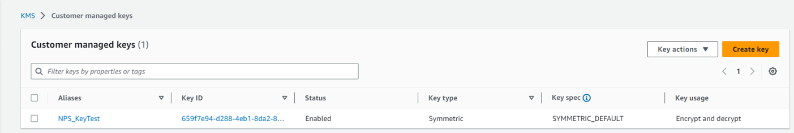
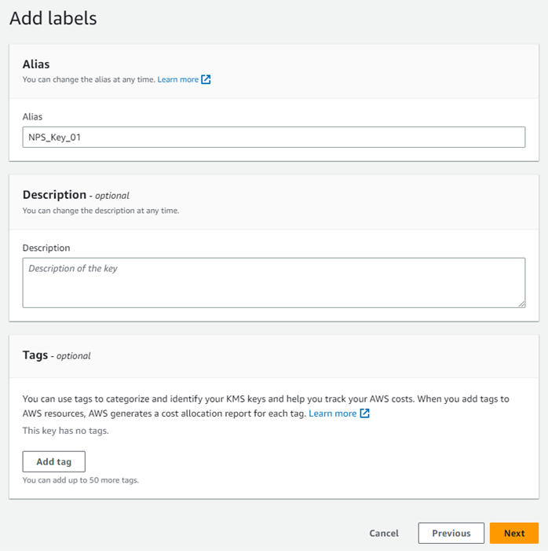

# AWS Key Management Service

AWS Key Management Service (AWS KMS) is a managed service that makes it easy for you to create and control the cryptographic keys that are used to protect your data. Organizations using AWS Key Management Service (AWS KMS) can configure Netwrix Privilege Secure to rotate security Keys. The KMS key is not used to encrypt the secret key, but will be used to encrypt the key that is used to encrypt the secret key.

See the [AWS Key Management Service](https://docs.aws.amazon.com/kms/latest/developerguide/overview.html "AWS Key Management Service") article for additional information.

When creating an AWS KMS protection key for Netwrix Privilege Secure, start by creating a policy in AWS. There will be multiple configuration steps needed within AWS.

* [Create an AWS Policy](#Create "Create an AWS Policy")
* [Create a User](#Create2 "Create a User")
* [Create a Managed Key](#Create3 "Create a Managed Key")
* [Least Privilege Policy](#Least "Least Privilege Policy")

### Create an AWS Policy

Follow the steps to create a policy in AWS.

**Step 1 –** Log into AWS.

**Step 2 –** Navigate to the **IAM** page, and then the **Policies** page.

**Step 3 –** Select **Create Policy**.

**Step 4 –** On the Specify permissions page, navigate to the Select a service box and search for the ‘KMS’ service.

**Step 5 –** Select the **KMS** option.

**Step 6 –** Under the Write dropdown menu, locate and select the **Decrypt permission** checkbox.

**Step 7 –** Under the Resources dropdown menu, select the **Any in this account** checkbox.

**NOTE:** This can be limited to a specific key when the key has been created.

**Step 8 –** Enter a name for the policy and a description (optional).

**Step 9 –** Save the policy.

The policy is created.

### Create a User

Follow the steps to create a user in AWS.

**Step 1 –** Navigate to the **IAM** page, and then the **User** page.

**Step 2 –** Select **Create User**.

**Step 3 –** On the Specify user details page, enter a user name. Optionally, select the **Provide user access to the AWS Management Console** checkbox.

**Step 4 –** In the Permissions options section, select **Attach policies directly** in the Permission options.

**Step 5 –** In the Permissions policies section, search for the NPS key policy you previously created and select the checkbox to the left of the policy. Click **Next**.

**Step 6 –** On the Review and create window, review the policy configuration and click **Create now**.

**Step 7 –** Once the user has been created, select the user and navigate to the **Security credentials** tab.

**Step 8 –** Select **Create access key**.

**Step 9 –** Once the creation window opens, select the **Application running outside of AWS** option.

**Step 10 –** Set an optional description tag if required, and then select **Create access key**.

**Step 11 –** Once the Key has been created, copy or download the Access key and Secret access key. These keys will be used by Privilege Secure to access the AWS KMS key encryption and decryption functionality.

**Step 12 –** Click **Done** when finished.

**CAUTION:**  Do not delete the AWS user Access Key without rotating the NPS key first.

The best practice for use of access keys is to rotate them regularly. Follow these steps when rotating access keys.

**Step 1 –** Create a new access key.

**Step 2 –** Rotate the NPS protect key to use the new access key.

**Step 3 –** Delete old access key.

### Create a Managed Key

Follow the steps to create a managed key in AWS.

**Step 1 –** Navigate to the **Key Management Service** page.

**Step 2 –** Select **Customer Managed Keys**.

**Step 3 –** Select **Create Key**.

**Step 4 –** For Key Type, Select **Symmetric**. For Key Usage, select **Encrypt and decrypt**. Click **Next** to continue.

**Step 5 –** Add an Alias for the key. The Description and Tags are optional. Click **Next** to continue.

**Step 6 –** Add a Key Administrator if required.

**NOTE:** The NPS Key user created earlier does not require administrative permissions at this level.

**Step 7 –** Select the checkbox for the Privilege Secure key user created earlier as a Key user. Click **Next** to continue.

**Step 8 –** Review the key configuration and click **Create Key** to continue.

**Step 9 –** Click the **Copy** button from the newly created key, and store the ARN from the details.

The ARN will be used by Privilege Secure to identify the key used for encryption.

### Least Privilege Policy

The IAM policy created earlier can now be edited to limit to only the required key. Follow the steps to create a least privilege policy.

**Step 1 –** Navigate to the IAM Policies page and select the KMS policy created in earlier steps.

**Step 2 –** Select the **Permissions** tab.

**Step 3 –** Click the **Edit** button.

**Step 4 –** Once the policy editor window opens, switch to the Visual display mode and expand the KMS item dropdown.

**Step 5 –** Expand the Resources item and remove the selection from **Any in this account** checkbox.

**Step 6 –** Click **Add Arn** to restrict access.

**Step 7 –** Paste the copied ARN for the NPS key into the bottom box then

**Step 8 –** Click **Add ARNs**.

**Step 9 –** Review configuration and click **Save changes** to the NPS\_KMS\_Policy.

The policy will now be limited to only the specified KMS key. The KMS is ready to be roated in Privilege Secure. See the [AWS KMS Key Rotation](AWSKeyRotation "AWS KMS Key Rotation") topic for additional information.