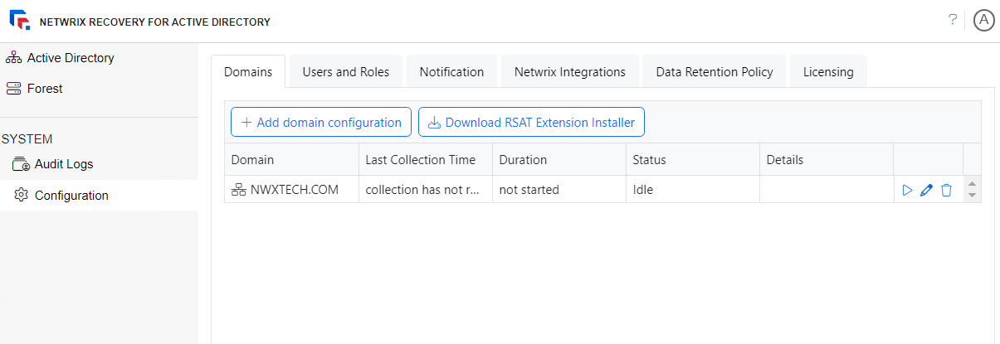

# Configuration Interface

The Configuration interface provides access to configure the domains, users and roles, notifications, integrations, data retention policy, and licensing for Recovery for Active Directory.

**NOTE:** Only users with Administrator rights have access to the Configuration interface.

The Configuration interface contains the following pages:

* [Domains Page](Domain "Domains Page") – The Domains page provides a list of the domains backed up by Recovery for Active Directory. It displays the backup schedule settings for each added domain. You can also add and configure new domains.
* [Users and Roles Page](Roles "Users and Roles Page") – The Users and Roles page displays the accounts with access to Recovery for Active Directory.
* [Notifications Page](Notifications "Notifications Page") – The Notifications page allows the configuration of notifications, which is required for sending an email when a collection (backup) job is completed.
* [Netwrix Integrations Page](Integration "Netwrix Integrations Page") – The Netwrix Integrations page provides the ability to configure access to the data in other Netwrix products. At present, only Netwrix Threat Prevention is supported.
* [Data Retention Policy Page](DataRetention "Data Retention Policy Page") – The Data Retention Policy page provides settings for deleting backup data that of domains and domain controllers has aged by X number of days, and for deleting backup data for tombstone objects that have been purged.
* [Licensing Page](Licensing "Licensing Page") – The Licensing page provides an overview of the organization's license status and the ability to import a license file.