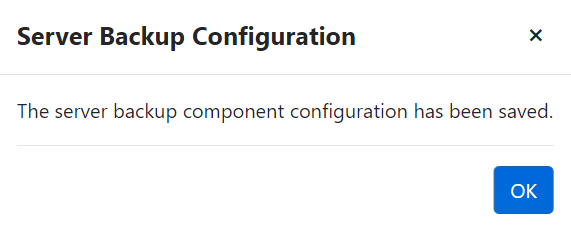

# Update Domain Controller Backup Account Password

While adding backup configurations for a domain controller on the Forest page, an account is provided for performing domain controller backups. You can update the password for this account or even specify a different account.

Follow the steps to update the backup account password for a domain controller.

**Step 1 –** Click **Forest** in the left pane to open the Forest page.

**Step 2 –** On the Forest page, select a forest to view the domain controllers in it. To locate a domain controller in a specific domain, expand the forest in the left pane and select a domain. The adjacent pane displays the domain controllers in that domain.

**Step 3 –** Click the **Edit** button for a domain controller, which is available in the far right of the domain controller row. The Server Backup Configuration wizard opens.

**Step 4 –** On the Server page, the fields are populated with the information you provided when configuring the domain controller backup. See the [Add Backup Configurations for a Domain Controller](../../Admin/Forest/Forest#Add "Add Backup Configurations for a Domain Controller") topic for additional information.

Enter the new password in the Password field and click **Next**. The next server backup will take into account the new password.

**Step 5 –** Modify the schedule if needed, then click **Next**.

**Step 6 –** Modify the options if needed, then click **Next**.

**Step 7 –** The Confirm page displays a summary of the settings you provided on the pages of the wizard. Use the Back button to return to a previous page and change any setting. Click **Complete** to finish the wizard.

**Step 8 –** Click **OK**.

The backup account password for the domain controller has been updated and saved.