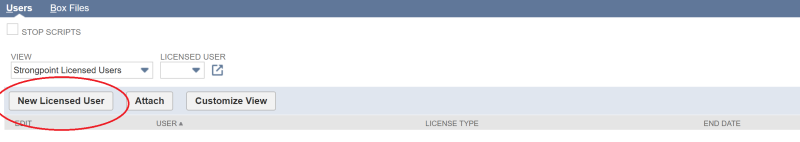

# Setting up a Licensed User

When you first install NetSuite, you need to create a licensed user who has full access to Flashlight. You can use this same procedure to switch permissions to an existing user.

1. Open **Flashlight** > **Support** > **Users & License Manager**.
2. Click **Edit**.

   
3. Select **New Licensed User**.

   

:::note
NOTE: If you are changing permission from one user to another, select Edit by the existing User name.
:::

4. Select your name from the **User** list and **Full** permission as the **License Type**.

   
5. Click **Save**.